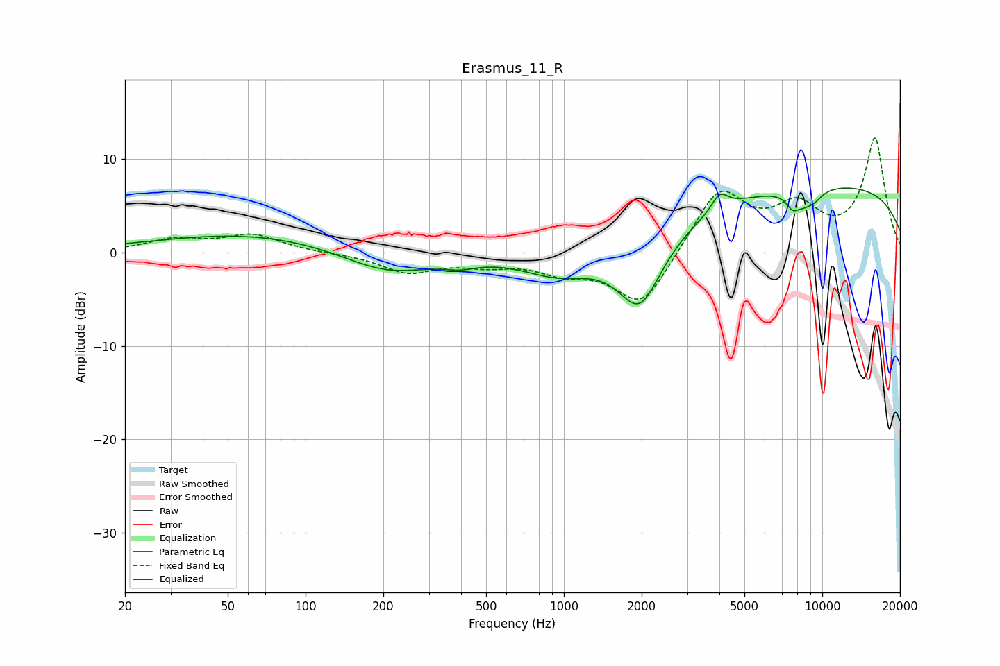

# Erasmus_11_R
See [usage instructions](https://github.com/jaakkopasanen/AutoEq#usage) for more options and info.

### Parametric EQs
Apply preamp of -7.0 dB when using parametric equalizer.

|   # | Type    |   Fc (Hz) |    Q |   Gain (dB) |
|-----|---------|-----------|------|-------------|
|   1 | Peaking |        62 | 0.38 |         2   |
|   2 | Peaking |       206 | 0.8  |        -2.6 |
|   3 | Peaking |       397 | 2.31 |        -0.6 |
|   4 | Peaking |       959 | 0.98 |        -2.6 |
|   5 | Peaking |      1969 | 1.6  |        -7.8 |
|   6 | Peaking |      4014 | 4.46 |         1.8 |
|   7 | Peaking |      7660 | 5.97 |        -1.1 |
|   8 | Peaking |      8413 | 2.7  |        -1.7 |
|   9 | Peaking |      9369 | 4.05 |        -0.6 |
|  10 | Peaking |     10000 | 0.19 |         7.3 |

### Fixed Band EQs
When using fixed band (also called graphic) equalizer, apply preamp of **-12.3 dB** (if available) and set gains manually with these parameters.

|   # | Type    |   Fc (Hz) |    Q |   Gain (dB) |
|-----|---------|-----------|------|-------------|
|   1 | Peaking |        31 | 1.41 |         1.3 |
|   2 | Peaking |        62 | 1.41 |         1.8 |
|   3 | Peaking |       125 | 1.41 |        -0.1 |
|   4 | Peaking |       250 | 1.41 |        -2   |
|   5 | Peaking |       500 | 1.41 |        -1   |
|   6 | Peaking |      1000 | 1.41 |        -1.7 |
|   7 | Peaking |      2000 | 1.41 |        -5.9 |
|   8 | Peaking |      4000 | 1.41 |         6.8 |
|   9 | Peaking |      8000 | 1.41 |         4.2 |
|  10 | Peaking |     16000 | 1.41 |        12   |

### Graphs

