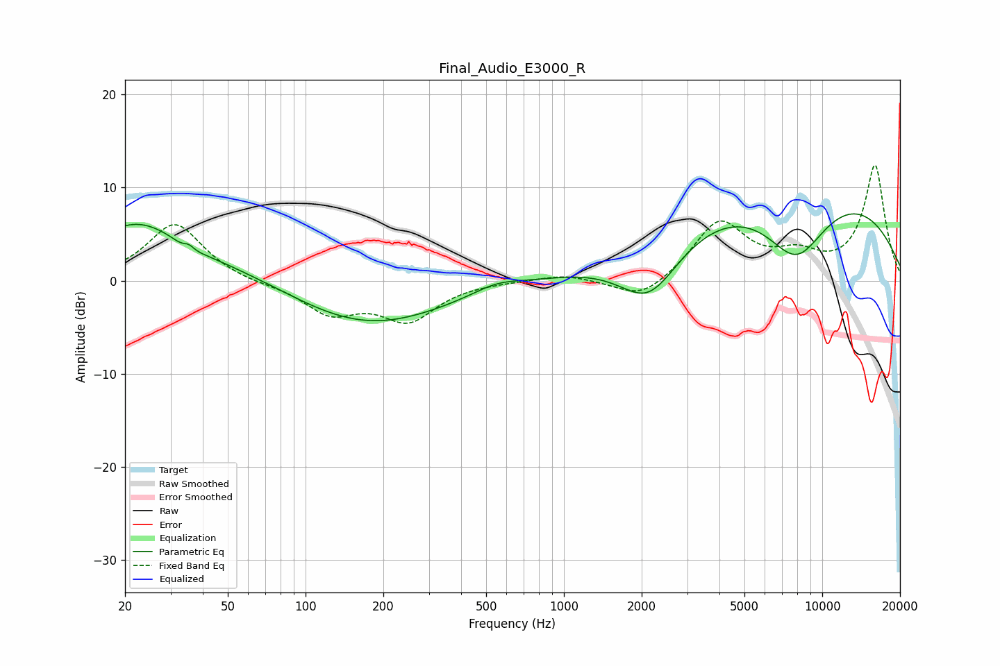

# Final_Audio_E3000_R
See [usage instructions](https://github.com/jaakkopasanen/AutoEq#usage) for more options and info.

### Parametric EQs
Apply preamp of -7.3 dB when using parametric equalizer.

|   # | Type    |   Fc (Hz) |    Q |   Gain (dB) |
|-----|---------|-----------|------|-------------|
|   1 | Peaking |        22 | 0.77 |         6   |
|   2 | Peaking |        35 | 4.27 |        -2   |
|   3 | Peaking |        35 | 5.56 |         2   |
|   4 | Peaking |        59 | 0.58 |         1.3 |
|   5 | Peaking |       172 | 0.46 |        -4.9 |
|   6 | Peaking |       555 | 1.53 |         1.2 |
|   7 | Peaking |       572 | 1.6  |        -0.2 |
|   8 | Peaking |      2134 | 1.16 |        -6.4 |
|   9 | Peaking |      7897 | 0.25 |        11.8 |
|  10 | Peaking |      7921 | 0.99 |        -8.6 |

### Fixed Band EQs
When using fixed band (also called graphic) equalizer, apply preamp of **-12.5 dB** (if available) and set gains manually with these parameters.

|   # | Type    |   Fc (Hz) |    Q |   Gain (dB) |
|-----|---------|-----------|------|-------------|
|   1 | Peaking |        31 | 1.41 |         6.2 |
|   2 | Peaking |        62 | 1.41 |        -0.3 |
|   3 | Peaking |       125 | 1.41 |        -3.3 |
|   4 | Peaking |       250 | 1.41 |        -4   |
|   5 | Peaking |       500 | 1.41 |        -0   |
|   6 | Peaking |      1000 | 1.41 |         0.7 |
|   7 | Peaking |      2000 | 1.41 |        -2.3 |
|   8 | Peaking |      4000 | 1.41 |         6.3 |
|   9 | Peaking |      8000 | 1.41 |         2.2 |
|  10 | Peaking |     16000 | 1.41 |        12.3 |

### Graphs

