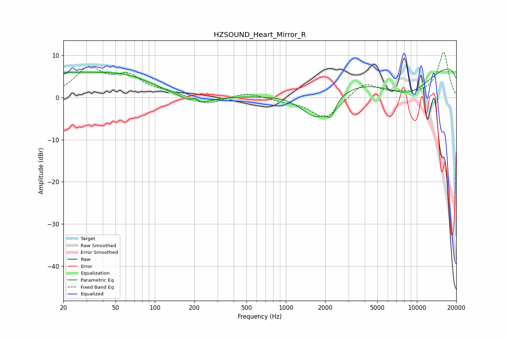

# HZSOUND_Heart_Mirror_R
See [usage instructions](https://github.com/jaakkopasanen/AutoEq#usage) for more options and info.

### Parametric EQs
Apply preamp of -6.8 dB when using parametric equalizer.

|   # | Type    |   Fc (Hz) |    Q |   Gain (dB) |
|-----|---------|-----------|------|-------------|
|   1 | Peaking |        22 | 5.27 |         0.1 |
|   2 | Peaking |        22 | 0.34 |         5.4 |
|   3 | Peaking |        64 | 0.74 |         2.4 |
|   4 | Peaking |       203 | 4.62 |        -2   |
|   5 | Peaking |       203 | 5.33 |         3.1 |
|   6 | Peaking |       208 | 1.53 |        -2.3 |
|   7 | Peaking |      1704 | 1.15 |        -7.6 |
|   8 | Peaking |      2216 | 4.55 |        -3.2 |
|   9 | Peaking |      8627 | 0.42 |       -13.3 |
|  10 | Peaking |     10000 | 0.18 |        15   |

### Fixed Band EQs
When using fixed band (also called graphic) equalizer, apply preamp of **-10.8 dB** (if available) and set gains manually with these parameters.

|   # | Type    |   Fc (Hz) |    Q |   Gain (dB) |
|-----|---------|-----------|------|-------------|
|   1 | Peaking |        31 | 1.41 |         6.5 |
|   2 | Peaking |        62 | 1.41 |         4.5 |
|   3 | Peaking |       125 | 1.41 |         1.1 |
|   4 | Peaking |       250 | 1.41 |        -1.8 |
|   5 | Peaking |       500 | 1.41 |         1.3 |
|   6 | Peaking |      1000 | 1.41 |        -0.6 |
|   7 | Peaking |      2000 | 1.41 |        -5.2 |
|   8 | Peaking |      4000 | 1.41 |         3.7 |
|   9 | Peaking |      8000 | 1.41 |         0.6 |
|  10 | Peaking |     16000 | 1.41 |        10.8 |

### Graphs

