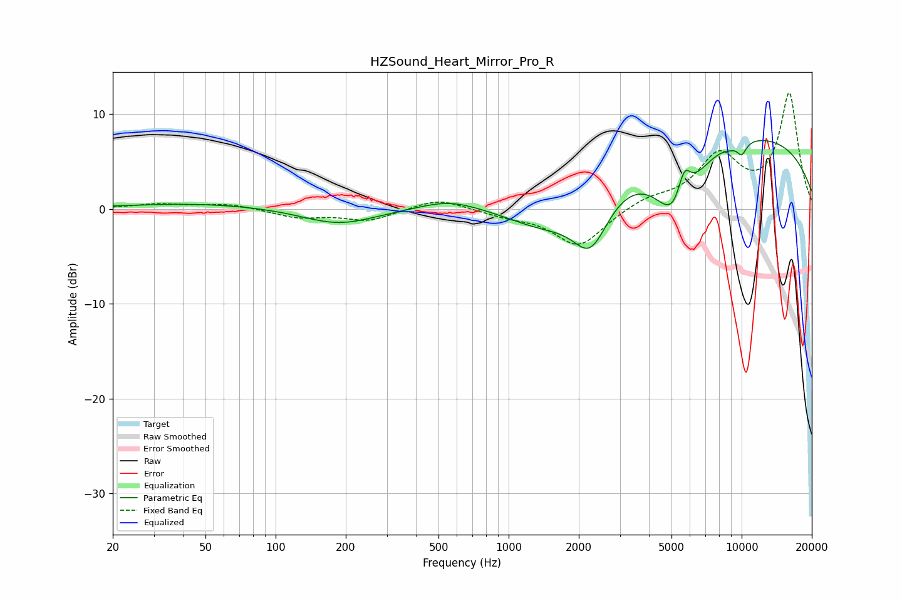

# HZSound_Heart_Mirror_Pro_R
See [usage instructions](https://github.com/jaakkopasanen/AutoEq#usage) for more options and info.

### Parametric EQs
Apply preamp of -7.3 dB when using parametric equalizer.

|   # | Type    |   Fc (Hz) |    Q |   Gain (dB) |
|-----|---------|-----------|------|-------------|
|   1 | Peaking |        48 | 0.45 |         0.6 |
|   2 | Peaking |       186 | 0.89 |        -1.7 |
|   3 | Peaking |       556 | 1.09 |         1.1 |
|   4 | Peaking |      1443 | 0.82 |        -3.5 |
|   5 | Peaking |      2246 | 1.76 |        -6   |
|   6 | Peaking |      5245 | 1.54 |        -7.8 |
|   7 | Peaking |      5665 | 4.53 |         3.9 |
|   8 | Peaking |      8529 | 0.2  |         8.3 |
|   9 | Peaking |      8904 | 5.19 |        -0.2 |
|  10 | Peaking |     10000 | 5.73 |        -1.3 |

### Fixed Band EQs
When using fixed band (also called graphic) equalizer, apply preamp of **-12.3 dB** (if available) and set gains manually with these parameters.

|   # | Type    |   Fc (Hz) |    Q |   Gain (dB) |
|-----|---------|-----------|------|-------------|
|   1 | Peaking |        31 | 1.41 |         0.5 |
|   2 | Peaking |        62 | 1.41 |         0.5 |
|   3 | Peaking |       125 | 1.41 |        -0.9 |
|   4 | Peaking |       250 | 1.41 |        -1.2 |
|   5 | Peaking |       500 | 1.41 |         1.2 |
|   6 | Peaking |      1000 | 1.41 |        -0.6 |
|   7 | Peaking |      2000 | 1.41 |        -4   |
|   8 | Peaking |      4000 | 1.41 |         1   |
|   9 | Peaking |      8000 | 1.41 |         5.3 |
|  10 | Peaking |     16000 | 1.41 |        12   |

### Graphs

