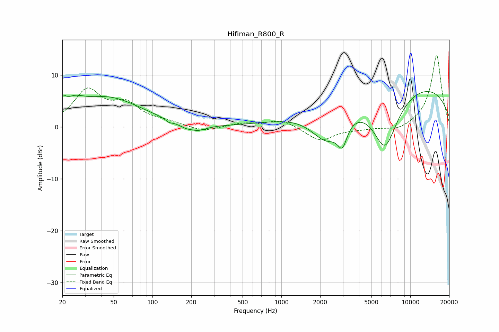

# Hifiman_R800_R
See [usage instructions](https://github.com/jaakkopasanen/AutoEq#usage) for more options and info.

### Parametric EQs
Apply preamp of -6.9 dB when using parametric equalizer.

|   # | Type    |   Fc (Hz) |    Q |   Gain (dB) |
|-----|---------|-----------|------|-------------|
|   1 | Peaking |        20 | 5.54 |         2   |
|   2 | Peaking |        25 | 1.92 |         2   |
|   3 | Peaking |        45 | 0.53 |         5.5 |
|   4 | Peaking |       134 | 5.71 |        -0.5 |
|   5 | Peaking |       203 | 3.93 |         0.6 |
|   6 | Peaking |       204 | 1.8  |        -2.1 |
|   7 | Peaking |      2242 | 1.11 |        -7   |
|   8 | Peaking |      2973 | 3.74 |        -4.3 |
|   9 | Peaking |      6361 | 1.3  |       -11.6 |
|  10 | Peaking |      7910 | 0.18 |         9.1 |

### Fixed Band EQs
When using fixed band (also called graphic) equalizer, apply preamp of **-13.9 dB** (if available) and set gains manually with these parameters.

|   # | Type    |   Fc (Hz) |    Q |   Gain (dB) |
|-----|---------|-----------|------|-------------|
|   1 | Peaking |        31 | 1.41 |         6.8 |
|   2 | Peaking |        62 | 1.41 |         3.8 |
|   3 | Peaking |       125 | 1.41 |         0.8 |
|   4 | Peaking |       250 | 1.41 |        -1   |
|   5 | Peaking |       500 | 1.41 |         0.7 |
|   6 | Peaking |      1000 | 1.41 |         1.4 |
|   7 | Peaking |      2000 | 1.41 |        -2.7 |
|   8 | Peaking |      4000 | 1.41 |        -0.3 |
|   9 | Peaking |      8000 | 1.41 |        -0.9 |
|  10 | Peaking |     16000 | 1.41 |        13.9 |

### Graphs

