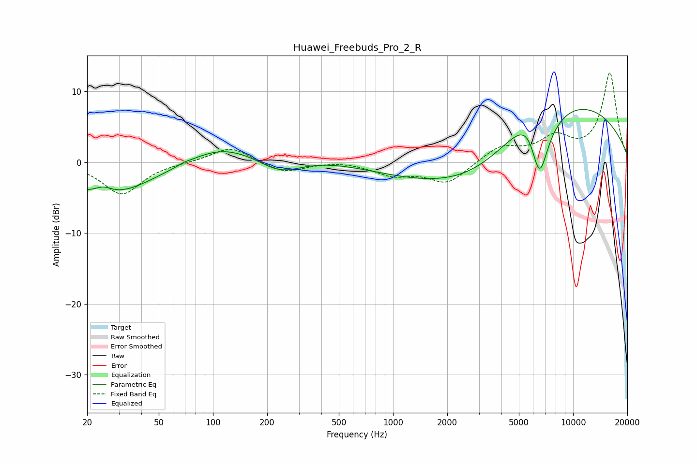

# Huawei_Freebuds_Pro_2_R
See [usage instructions](https://github.com/jaakkopasanen/AutoEq#usage) for more options and info.

### Parametric EQs
Apply preamp of -7.6 dB when using parametric equalizer.

|   # | Type    |   Fc (Hz) |    Q |   Gain (dB) |
|-----|---------|-----------|------|-------------|
|   1 | Peaking |        25 | 2.85 |         1.1 |
|   2 | Peaking |        26 | 0.57 |        -4.9 |
|   3 | Peaking |        69 | 5.68 |         0.2 |
|   4 | Peaking |       108 | 0.76 |         2.1 |
|   5 | Peaking |       236 | 1.13 |        -2.5 |
|   6 | Peaking |       340 | 0.32 |         1.4 |
|   7 | Peaking |      3022 | 0.33 |       -12.1 |
|   8 | Peaking |      5965 | 1.47 |         7.4 |
|   9 | Peaking |      6444 | 0.29 |        16.5 |
|  10 | Peaking |      6480 | 1.91 |       -15.6 |

### Fixed Band EQs
When using fixed band (also called graphic) equalizer, apply preamp of **-12.7 dB** (if available) and set gains manually with these parameters.

|   # | Type    |   Fc (Hz) |    Q |   Gain (dB) |
|-----|---------|-----------|------|-------------|
|   1 | Peaking |        31 | 1.41 |        -4.5 |
|   2 | Peaking |        62 | 1.41 |        -0   |
|   3 | Peaking |       125 | 1.41 |         2.2 |
|   4 | Peaking |       250 | 1.41 |        -1.5 |
|   5 | Peaking |       500 | 1.41 |         0.2 |
|   6 | Peaking |      1000 | 1.41 |        -1.7 |
|   7 | Peaking |      2000 | 1.41 |        -3   |
|   8 | Peaking |      4000 | 1.41 |         2.2 |
|   9 | Peaking |      8000 | 1.41 |         3.1 |
|  10 | Peaking |     16000 | 1.41 |        12.5 |

### Graphs

