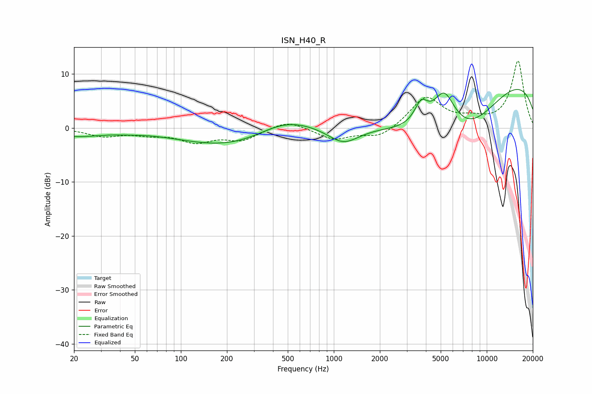

# ISN_H40_R
See [usage instructions](https://github.com/jaakkopasanen/AutoEq#usage) for more options and info.

### Parametric EQs
Apply preamp of -7.2 dB when using parametric equalizer.

|   # | Type    |   Fc (Hz) |    Q |   Gain (dB) |
|-----|---------|-----------|------|-------------|
|   1 | Peaking |        20 | 0.79 |        -1.4 |
|   2 | Peaking |        45 | 2.01 |        -0.2 |
|   3 | Peaking |       243 | 0.4  |        -4.1 |
|   4 | Peaking |       474 | 0.69 |         3.8 |
|   5 | Peaking |      1155 | 1.36 |        -3.2 |
|   6 | Peaking |      3678 | 0.43 |        -6.1 |
|   7 | Peaking |      3726 | 3.14 |         3.9 |
|   8 | Peaking |      5270 | 1.92 |         7   |
|   9 | Peaking |      7625 | 0.59 |        -7.5 |
|  10 | Peaking |      9522 | 0.18 |        11.1 |

### Fixed Band EQs
When using fixed band (also called graphic) equalizer, apply preamp of **-12.5 dB** (if available) and set gains manually with these parameters.

|   # | Type    |   Fc (Hz) |    Q |   Gain (dB) |
|-----|---------|-----------|------|-------------|
|   1 | Peaking |        31 | 1.41 |        -1.4 |
|   2 | Peaking |        62 | 1.41 |        -1   |
|   3 | Peaking |       125 | 1.41 |        -2.4 |
|   4 | Peaking |       250 | 1.41 |        -2.1 |
|   5 | Peaking |       500 | 1.41 |         1.5 |
|   6 | Peaking |      1000 | 1.41 |        -2.1 |
|   7 | Peaking |      2000 | 1.41 |        -1.9 |
|   8 | Peaking |      4000 | 1.41 |         5.7 |
|   9 | Peaking |      8000 | 1.41 |         1.2 |
|  10 | Peaking |     16000 | 1.41 |        12.4 |

### Graphs

