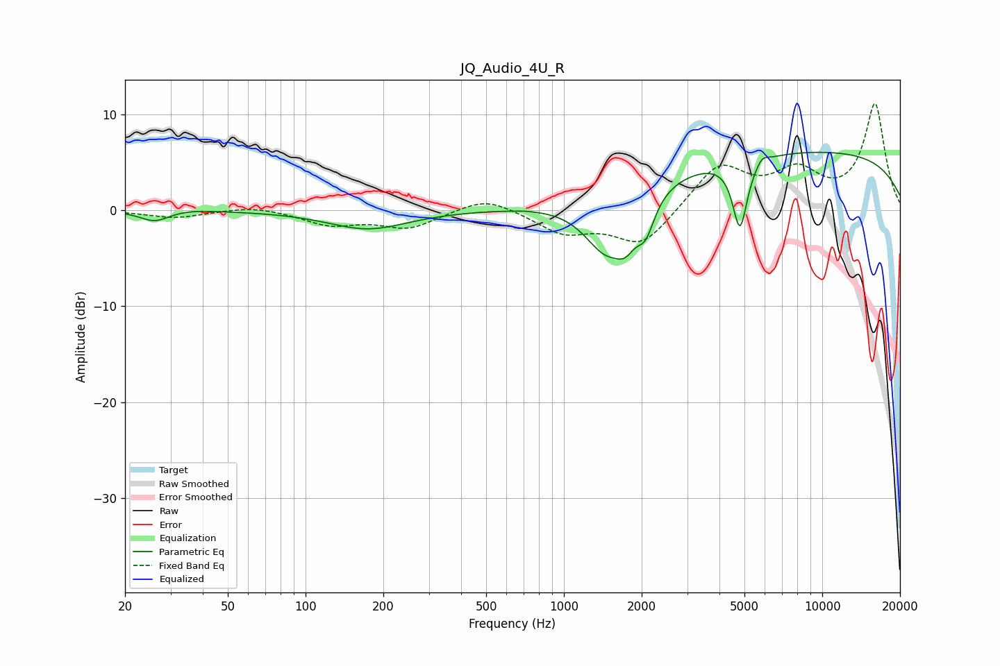

# JQ_Audio_4U_R
See [usage instructions](https://github.com/jaakkopasanen/AutoEq#usage) for more options and info.

### Parametric EQs
Apply preamp of -6.1 dB when using parametric equalizer.

|   # | Type    |   Fc (Hz) |    Q |   Gain (dB) |
|-----|---------|-----------|------|-------------|
|   1 | Peaking |        26 | 2.54 |        -1.1 |
|   2 | Peaking |        35 | 1.63 |         0.2 |
|   3 | Peaking |       174 | 0.92 |        -2   |
|   4 | Peaking |       704 | 5.6  |         0   |
|   5 | Peaking |      1456 | 1.62 |        -5.9 |
|   6 | Peaking |      1734 | 3.51 |        -2.6 |
|   7 | Peaking |      2072 | 4.09 |        -3.3 |
|   8 | Peaking |      4804 | 4.96 |        -7.2 |
|   9 | Peaking |      5850 | 6    |         0.8 |
|  10 | Peaking |      8460 | 0.18 |         6.2 |

### Fixed Band EQs
When using fixed band (also called graphic) equalizer, apply preamp of **-11.2 dB** (if available) and set gains manually with these parameters.

|   # | Type    |   Fc (Hz) |    Q |   Gain (dB) |
|-----|---------|-----------|------|-------------|
|   1 | Peaking |        31 | 1.41 |        -0.8 |
|   2 | Peaking |        62 | 1.41 |         0.5 |
|   3 | Peaking |       125 | 1.41 |        -1.4 |
|   4 | Peaking |       250 | 1.41 |        -1.8 |
|   5 | Peaking |       500 | 1.41 |         1.5 |
|   6 | Peaking |      1000 | 1.41 |        -2.2 |
|   7 | Peaking |      2000 | 1.41 |        -3.8 |
|   8 | Peaking |      4000 | 1.41 |         4.7 |
|   9 | Peaking |      8000 | 1.41 |         3.6 |
|  10 | Peaking |     16000 | 1.41 |        11   |

### Graphs

