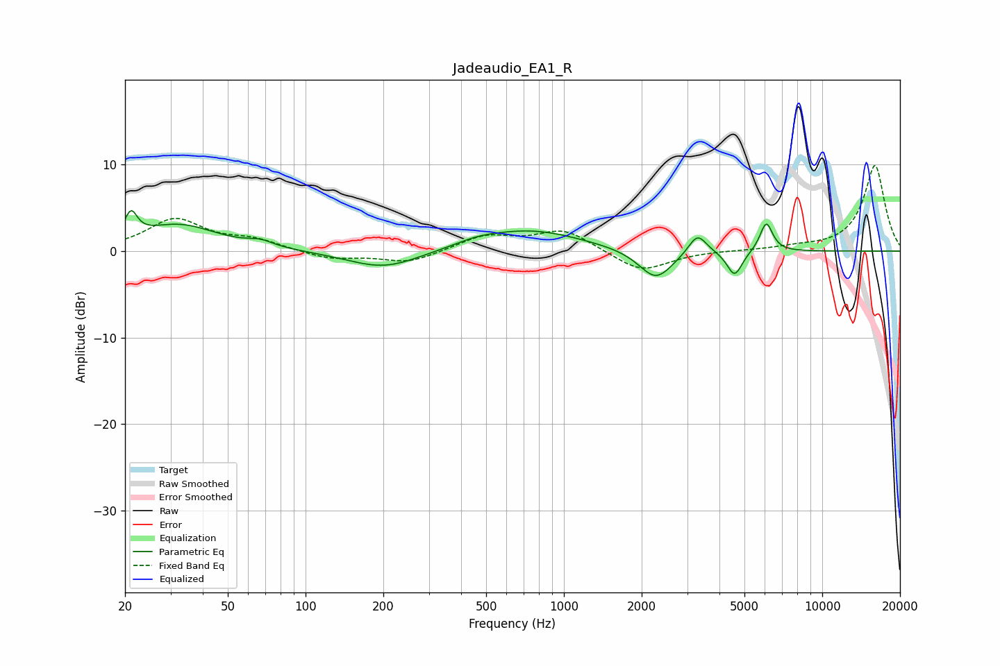

# Jadeaudio_EA1_R
See [usage instructions](https://github.com/jaakkopasanen/AutoEq#usage) for more options and info.

### Parametric EQs
Apply preamp of -4.8 dB when using parametric equalizer.

|   # | Type    |   Fc (Hz) |    Q |   Gain (dB) |
|-----|---------|-----------|------|-------------|
|   1 | Peaking |        21 | 5.93 |         2.9 |
|   2 | Peaking |        32 | 0.94 |         3   |
|   3 | Peaking |        67 | 2.85 |         0.7 |
|   4 | Peaking |       201 | 1.01 |        -2.1 |
|   5 | Peaking |       464 | 1.71 |         0.5 |
|   6 | Peaking |       737 | 0.71 |         2.4 |
|   7 | Peaking |      2269 | 2.16 |        -3.5 |
|   8 | Peaking |      3289 | 4.01 |         2.4 |
|   9 | Peaking |      4580 | 4.77 |        -2.9 |
|  10 | Peaking |      6073 | 5.64 |         3.4 |

### Fixed Band EQs
When using fixed band (also called graphic) equalizer, apply preamp of **-10.0 dB** (if available) and set gains manually with these parameters.

|   # | Type    |   Fc (Hz) |    Q |   Gain (dB) |
|-----|---------|-----------|------|-------------|
|   1 | Peaking |        31 | 1.41 |         3.6 |
|   2 | Peaking |        62 | 1.41 |         1.1 |
|   3 | Peaking |       125 | 1.41 |        -0.9 |
|   4 | Peaking |       250 | 1.41 |        -1.4 |
|   5 | Peaking |       500 | 1.41 |         1.7 |
|   6 | Peaking |      1000 | 1.41 |         2.4 |
|   7 | Peaking |      2000 | 1.41 |        -2.5 |
|   8 | Peaking |      4000 | 1.41 |         0   |
|   9 | Peaking |      8000 | 1.41 |         0.3 |
|  10 | Peaking |     16000 | 1.41 |         9.9 |

### Graphs

