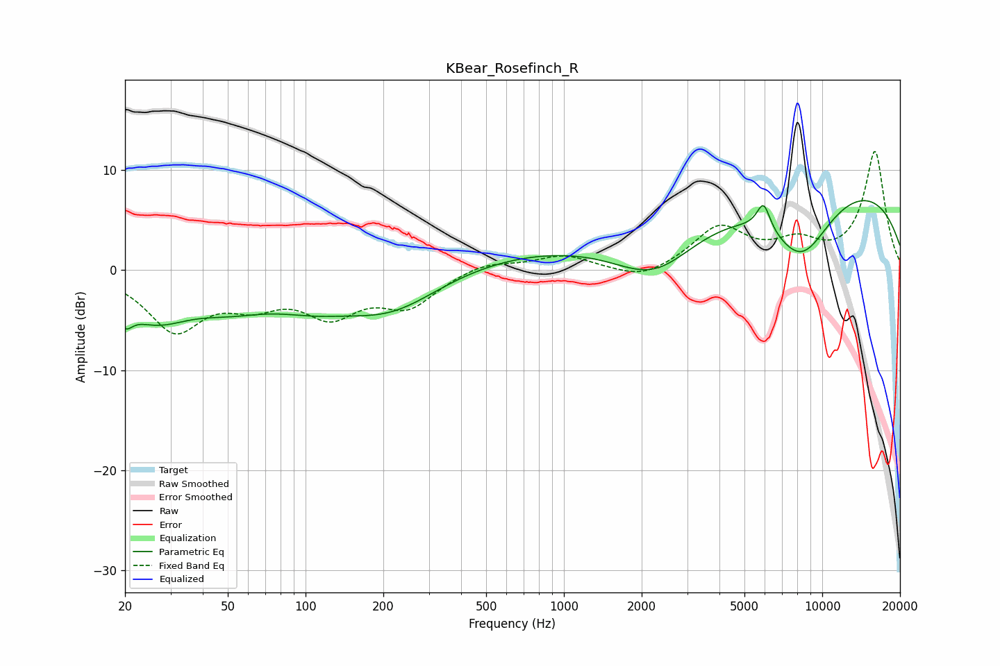

# KBear_Rosefinch_R
See [usage instructions](https://github.com/jaakkopasanen/AutoEq#usage) for more options and info.

### Parametric EQs
Apply preamp of -7.0 dB when using parametric equalizer.

|   # | Type    |   Fc (Hz) |    Q |   Gain (dB) |
|-----|---------|-----------|------|-------------|
|   1 | Peaking |        20 | 5.09 |        -2   |
|   2 | Peaking |        26 | 1.02 |        -4.2 |
|   3 | Peaking |        52 | 0.89 |        -2.3 |
|   4 | Peaking |       105 | 0.88 |        -2   |
|   5 | Peaking |       214 | 0.72 |        -4   |
|   6 | Peaking |       925 | 0.32 |         2.1 |
|   7 | Peaking |      2245 | 0.86 |        -4.8 |
|   8 | Peaking |      5927 | 5.28 |         2.8 |
|   9 | Peaking |      8288 | 1.06 |        -7.1 |
|  10 | Peaking |     10000 | 0.22 |         9.1 |

### Fixed Band EQs
When using fixed band (also called graphic) equalizer, apply preamp of **-11.9 dB** (if available) and set gains manually with these parameters.

|   # | Type    |   Fc (Hz) |    Q |   Gain (dB) |
|-----|---------|-----------|------|-------------|
|   1 | Peaking |        31 | 1.41 |        -5.7 |
|   2 | Peaking |        62 | 1.41 |        -2.6 |
|   3 | Peaking |       125 | 1.41 |        -4   |
|   4 | Peaking |       250 | 1.41 |        -3.3 |
|   5 | Peaking |       500 | 1.41 |         0.9 |
|   6 | Peaking |      1000 | 1.41 |         1.4 |
|   7 | Peaking |      2000 | 1.41 |        -1.2 |
|   8 | Peaking |      4000 | 1.41 |         4.1 |
|   9 | Peaking |      8000 | 1.41 |         2.3 |
|  10 | Peaking |     16000 | 1.41 |        11.8 |

### Graphs

