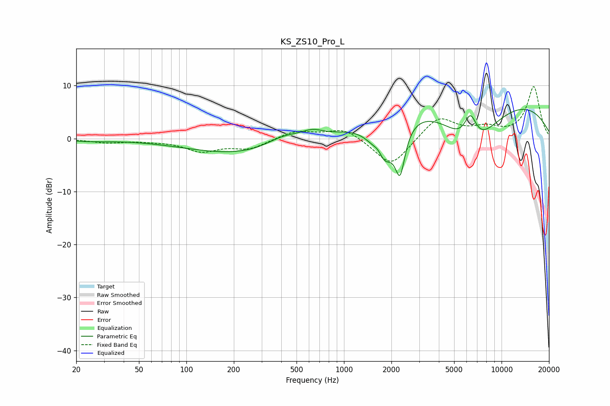

# KS_ZS10_Pro_L
See [usage instructions](https://github.com/jaakkopasanen/AutoEq#usage) for more options and info.

### Parametric EQs
Apply preamp of -5.6 dB when using parametric equalizer.

|   # | Type    |   Fc (Hz) |    Q |   Gain (dB) |
|-----|---------|-----------|------|-------------|
|   1 | Peaking |        24 | 1.1  |        -0.4 |
|   2 | Peaking |       360 | 0.29 |        -3.9 |
|   3 | Peaking |       416 | 1.12 |         2.6 |
|   4 | Peaking |       630 | 1.96 |         1.6 |
|   5 | Peaking |      1667 | 4.25 |         2.7 |
|   6 | Peaking |      1757 | 2.08 |        -9.6 |
|   7 | Peaking |      2271 | 4.39 |        -8.6 |
|   8 | Peaking |      5788 | 0.18 |        11.2 |
|   9 | Peaking |      6345 | 3.18 |         6.1 |
|  10 | Peaking |      6428 | 0.78 |       -12.6 |

### Fixed Band EQs
When using fixed band (also called graphic) equalizer, apply preamp of **-9.9 dB** (if available) and set gains manually with these parameters.

|   # | Type    |   Fc (Hz) |    Q |   Gain (dB) |
|-----|---------|-----------|------|-------------|
|   1 | Peaking |        31 | 1.41 |        -0.7 |
|   2 | Peaking |        62 | 1.41 |        -0.3 |
|   3 | Peaking |       125 | 1.41 |        -2.2 |
|   4 | Peaking |       250 | 1.41 |        -1.8 |
|   5 | Peaking |       500 | 1.41 |         1.5 |
|   6 | Peaking |      1000 | 1.41 |         2   |
|   7 | Peaking |      2000 | 1.41 |        -5.5 |
|   8 | Peaking |      4000 | 1.41 |         4.2 |
|   9 | Peaking |      8000 | 1.41 |         1.7 |
|  10 | Peaking |     16000 | 1.41 |         9.8 |

### Graphs

