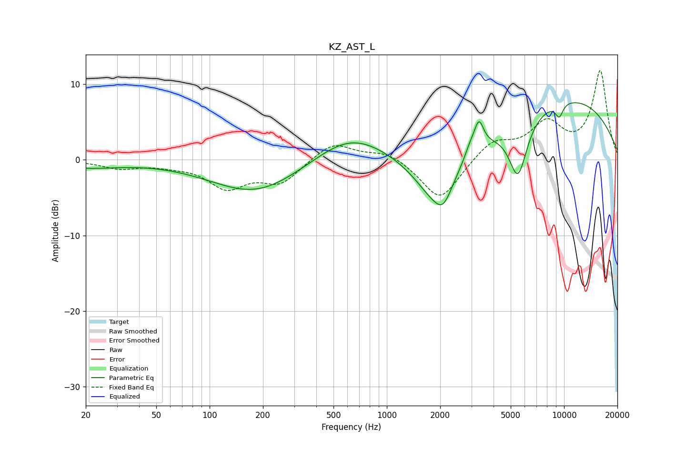

# KZ_AST_L
See [usage instructions](https://github.com/jaakkopasanen/AutoEq#usage) for more options and info.

### Parametric EQs
Apply preamp of -7.7 dB when using parametric equalizer.

|   # | Type    |   Fc (Hz) |    Q |   Gain (dB) |
|-----|---------|-----------|------|-------------|
|   1 | Peaking |        20 | 0.76 |        -1   |
|   2 | Peaking |       183 | 0.56 |        -4.5 |
|   3 | Peaking |       623 | 0.7  |         3.8 |
|   4 | Peaking |      1896 | 1.14 |        -6.5 |
|   5 | Peaking |      2086 | 3.06 |        -2.4 |
|   6 | Peaking |      2948 | 4.55 |         1.2 |
|   7 | Peaking |      3308 | 5.27 |         3.6 |
|   8 | Peaking |      5495 | 2.64 |        -7.8 |
|   9 | Peaking |      9395 | 5.83 |        -1.8 |
|  10 | Peaking |      9983 | 0.31 |         8.2 |

### Fixed Band EQs
When using fixed band (also called graphic) equalizer, apply preamp of **-11.9 dB** (if available) and set gains manually with these parameters.

|   # | Type    |   Fc (Hz) |    Q |   Gain (dB) |
|-----|---------|-----------|------|-------------|
|   1 | Peaking |        31 | 1.41 |        -1   |
|   2 | Peaking |        62 | 1.41 |        -0.5 |
|   3 | Peaking |       125 | 1.41 |        -3.5 |
|   4 | Peaking |       250 | 1.41 |        -2.9 |
|   5 | Peaking |       500 | 1.41 |         2.4 |
|   6 | Peaking |      1000 | 1.41 |         1.2 |
|   7 | Peaking |      2000 | 1.41 |        -5.5 |
|   8 | Peaking |      4000 | 1.41 |         2.5 |
|   9 | Peaking |      8000 | 1.41 |         4.5 |
|  10 | Peaking |     16000 | 1.41 |        11.7 |

### Graphs

