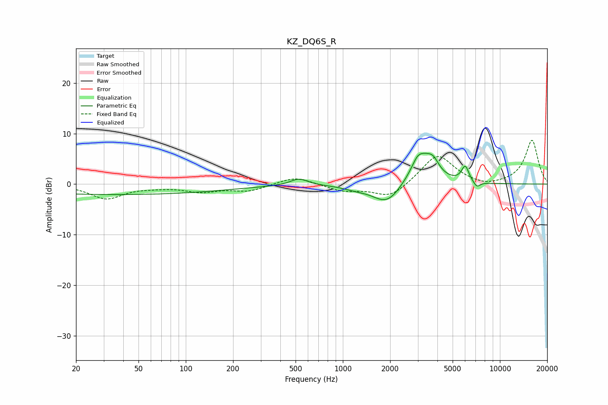

# KZ_DQ6S_R
See [usage instructions](https://github.com/jaakkopasanen/AutoEq#usage) for more options and info.

### Parametric EQs
Apply preamp of -6.2 dB when using parametric equalizer.

|   # | Type    |   Fc (Hz) |    Q |   Gain (dB) |
|-----|---------|-----------|------|-------------|
|   1 | Peaking |        36 | 0.18 |        -2.1 |
|   2 | Peaking |       526 | 2.54 |         1.4 |
|   3 | Peaking |      1252 | 1.67 |        -0.9 |
|   4 | Peaking |      1385 | 1.56 |         0.4 |
|   5 | Peaking |      1910 | 1.5  |        -4.2 |
|   6 | Peaking |      2964 | 6    |         0.7 |
|   7 | Peaking |      3157 | 1.91 |         6   |
|   8 | Peaking |      3760 | 3.84 |         2.2 |
|   9 | Peaking |      6014 | 5.89 |         3.1 |
|  10 | Peaking |      7124 | 6    |        -1.2 |

### Fixed Band EQs
When using fixed band (also called graphic) equalizer, apply preamp of **-8.8 dB** (if available) and set gains manually with these parameters.

|   # | Type    |   Fc (Hz) |    Q |   Gain (dB) |
|-----|---------|-----------|------|-------------|
|   1 | Peaking |        31 | 1.41 |        -2.8 |
|   2 | Peaking |        62 | 1.41 |        -0.4 |
|   3 | Peaking |       125 | 1.41 |        -1.3 |
|   4 | Peaking |       250 | 1.41 |        -1.3 |
|   5 | Peaking |       500 | 1.41 |         1.6 |
|   6 | Peaking |      1000 | 1.41 |        -1.3 |
|   7 | Peaking |      2000 | 1.41 |        -2.8 |
|   8 | Peaking |      4000 | 1.41 |         6   |
|   9 | Peaking |      8000 | 1.41 |        -0.7 |
|  10 | Peaking |     16000 | 1.41 |         8.7 |

### Graphs

