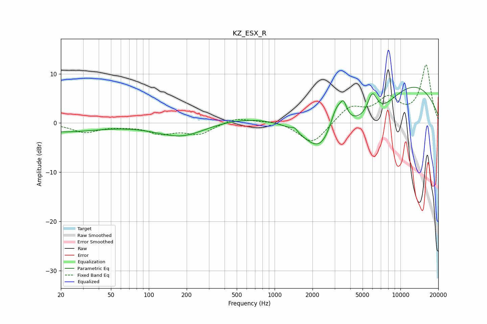

# KZ_ESX_R
See [usage instructions](https://github.com/jaakkopasanen/AutoEq#usage) for more options and info.

### Parametric EQs
Apply preamp of -7.4 dB when using parametric equalizer.

|   # | Type    |   Fc (Hz) |    Q |   Gain (dB) |
|-----|---------|-----------|------|-------------|
|   1 | Peaking |        20 | 0.47 |        -1.7 |
|   2 | Peaking |       184 | 0.71 |        -3.1 |
|   3 | Peaking |      1066 | 0.23 |         1.8 |
|   4 | Peaking |      1437 | 5.97 |         0.8 |
|   5 | Peaking |      2363 | 0.91 |        -9   |
|   6 | Peaking |      3101 | 2.53 |         6   |
|   7 | Peaking |      3535 | 5.51 |         2.8 |
|   8 | Peaking |      5979 | 3.43 |         4.9 |
|   9 | Peaking |      6242 | 0.69 |        -6.6 |
|  10 | Peaking |      9925 | 0.31 |         9.9 |

### Fixed Band EQs
When using fixed band (also called graphic) equalizer, apply preamp of **-11.9 dB** (if available) and set gains manually with these parameters.

|   # | Type    |   Fc (Hz) |    Q |   Gain (dB) |
|-----|---------|-----------|------|-------------|
|   1 | Peaking |        31 | 1.41 |        -1.8 |
|   2 | Peaking |        62 | 1.41 |        -0.4 |
|   3 | Peaking |       125 | 1.41 |        -1.9 |
|   4 | Peaking |       250 | 1.41 |        -2.2 |
|   5 | Peaking |       500 | 1.41 |         1.2 |
|   6 | Peaking |      1000 | 1.41 |         0.5 |
|   7 | Peaking |      2000 | 1.41 |        -4.4 |
|   8 | Peaking |      4000 | 1.41 |         3.2 |
|   9 | Peaking |      8000 | 1.41 |         4.5 |
|  10 | Peaking |     16000 | 1.41 |        11.6 |

### Graphs

