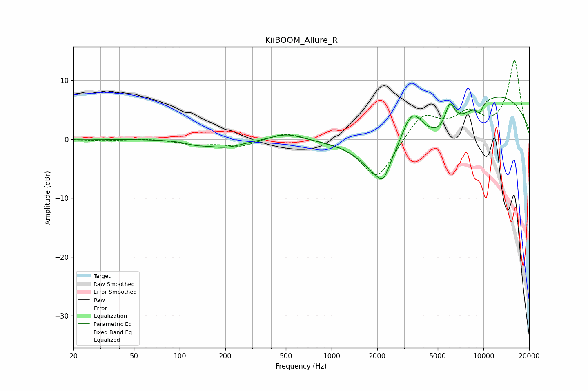

# KiiBOOM_Allure_R
See [usage instructions](https://github.com/jaakkopasanen/AutoEq#usage) for more options and info.

### Parametric EQs
Apply preamp of -7.2 dB when using parametric equalizer.

|   # | Type    |   Fc (Hz) |    Q |   Gain (dB) |
|-----|---------|-----------|------|-------------|
|   1 | Peaking |       128 | 2.12 |        -0.5 |
|   2 | Peaking |       200 | 1.21 |        -1.3 |
|   3 | Peaking |       506 | 1.47 |         1.1 |
|   4 | Peaking |      2097 | 1.12 |        -7.7 |
|   5 | Peaking |      2182 | 4.12 |        -1.9 |
|   6 | Peaking |      3372 | 1.97 |         5.7 |
|   7 | Peaking |      5511 | 0.84 |        -6.2 |
|   8 | Peaking |      6014 | 3.98 |         4.6 |
|   9 | Peaking |      9433 | 5.86 |        -1.6 |
|  10 | Peaking |     10000 | 0.27 |         8.6 |

### Fixed Band EQs
When using fixed band (also called graphic) equalizer, apply preamp of **-13.4 dB** (if available) and set gains manually with these parameters.

|   # | Type    |   Fc (Hz) |    Q |   Gain (dB) |
|-----|---------|-----------|------|-------------|
|   1 | Peaking |        31 | 1.41 |        -0.2 |
|   2 | Peaking |        62 | 1.41 |         0.1 |
|   3 | Peaking |       125 | 1.41 |        -0.8 |
|   4 | Peaking |       250 | 1.41 |        -1.2 |
|   5 | Peaking |       500 | 1.41 |         1.3 |
|   6 | Peaking |      1000 | 1.41 |        -0.2 |
|   7 | Peaking |      2000 | 1.41 |        -6.9 |
|   8 | Peaking |      4000 | 1.41 |         4.4 |
|   9 | Peaking |      8000 | 1.41 |         3.8 |
|  10 | Peaking |     16000 | 1.41 |        13.2 |

### Graphs

