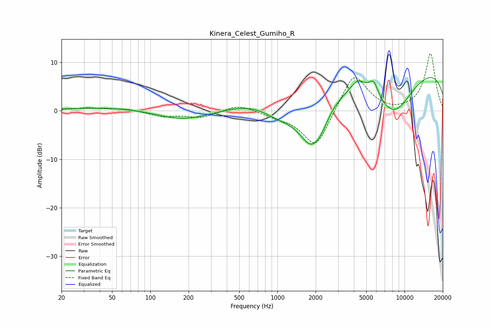

# Kinera_Celest_Gumiho_R
See [usage instructions](https://github.com/jaakkopasanen/AutoEq#usage) for more options and info.

### Parametric EQs
Apply preamp of -7.0 dB when using parametric equalizer.

|   # | Type    |   Fc (Hz) |    Q |   Gain (dB) |
|-----|---------|-----------|------|-------------|
|   1 | Peaking |        47 | 0.43 |         0.7 |
|   2 | Peaking |       179 | 0.72 |        -1.9 |
|   3 | Peaking |       611 | 0.78 |         1.5 |
|   4 | Peaking |      1052 | 1.05 |        -2.1 |
|   5 | Peaking |      1825 | 1.41 |        -8.5 |
|   6 | Peaking |      2187 | 2.28 |        -2.4 |
|   7 | Peaking |      4306 | 2.43 |         2.6 |
|   8 | Peaking |      5702 | 3.74 |         3.2 |
|   9 | Peaking |      8218 | 0.76 |        -9.9 |
|  10 | Peaking |     10000 | 0.18 |        10.2 |

### Fixed Band EQs
When using fixed band (also called graphic) equalizer, apply preamp of **-11.9 dB** (if available) and set gains manually with these parameters.

|   # | Type    |   Fc (Hz) |    Q |   Gain (dB) |
|-----|---------|-----------|------|-------------|
|   1 | Peaking |        31 | 1.41 |         0.6 |
|   2 | Peaking |        62 | 1.41 |         0.5 |
|   3 | Peaking |       125 | 1.41 |        -1.1 |
|   4 | Peaking |       250 | 1.41 |        -1.3 |
|   5 | Peaking |       500 | 1.41 |         1.4 |
|   6 | Peaking |      1000 | 1.41 |        -0.9 |
|   7 | Peaking |      2000 | 1.41 |        -7.9 |
|   8 | Peaking |      4000 | 1.41 |         8.2 |
|   9 | Peaking |      8000 | 1.41 |        -0.4 |
|  10 | Peaking |     16000 | 1.41 |        11.8 |

### Graphs

