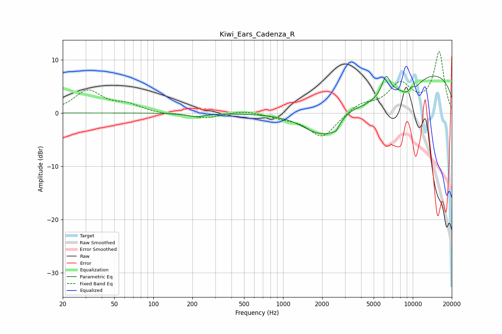

# Kiwi_Ears_Cadenza_R
See [usage instructions](https://github.com/jaakkopasanen/AutoEq#usage) for more options and info.

### Parametric EQs
Apply preamp of -7.0 dB when using parametric equalizer.

|   # | Type    |   Fc (Hz) |    Q |   Gain (dB) |
|-----|---------|-----------|------|-------------|
|   1 | Peaking |       216 | 2.21 |        -0.7 |
|   2 | Peaking |      1857 | 1.17 |        -3.3 |
|   3 | Peaking |      2250 | 3.25 |        -0.9 |
|   4 | Peaking |      2562 | 5.91 |        -1.2 |
|   5 | Peaking |      3416 | 1.96 |         0.7 |
|   6 | Peaking |      3624 | 0.44 |        -5.4 |
|   7 | Peaking |      6218 | 4.19 |         3.7 |
|   8 | Peaking |      9596 | 1.99 |        -3.3 |
|   9 | Peaking |      9762 | 4.71 |         1.7 |
|  10 | Peaking |      9959 | 0.18 |         8.5 |

### Fixed Band EQs
When using fixed band (also called graphic) equalizer, apply preamp of **-11.6 dB** (if available) and set gains manually with these parameters.

|   # | Type    |   Fc (Hz) |    Q |   Gain (dB) |
|-----|---------|-----------|------|-------------|
|   1 | Peaking |        31 | 1.41 |         4.1 |
|   2 | Peaking |        62 | 1.41 |         1.4 |
|   3 | Peaking |       125 | 1.41 |        -0.3 |
|   4 | Peaking |       250 | 1.41 |        -0.9 |
|   5 | Peaking |       500 | 1.41 |         0.5 |
|   6 | Peaking |      1000 | 1.41 |        -0.6 |
|   7 | Peaking |      2000 | 1.41 |        -4.7 |
|   8 | Peaking |      4000 | 1.41 |         1.7 |
|   9 | Peaking |      8000 | 1.41 |         5.1 |
|  10 | Peaking |     16000 | 1.41 |        11.3 |

### Graphs

