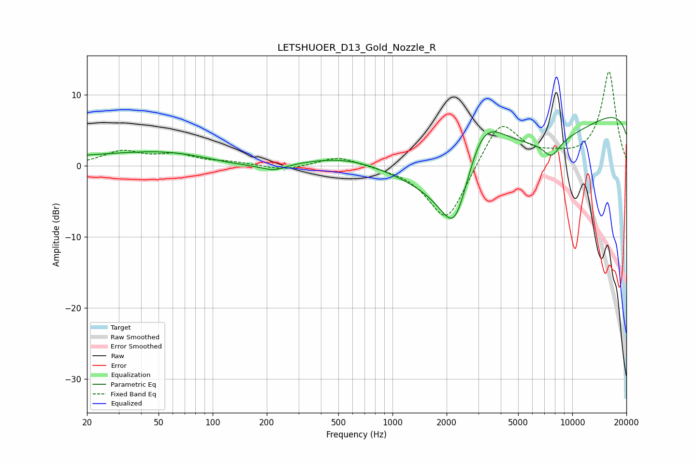

# LETSHUOER_D13_Gold_Nozzle_R
See [usage instructions](https://github.com/jaakkopasanen/AutoEq#usage) for more options and info.

### Parametric EQs
Apply preamp of -6.9 dB when using parametric equalizer.

|   # | Type    |   Fc (Hz) |    Q |   Gain (dB) |
|-----|---------|-----------|------|-------------|
|   1 | Peaking |        26 | 0.31 |         1.2 |
|   2 | Peaking |        63 | 0.56 |         1.3 |
|   3 | Peaking |       219 | 2.27 |        -0.8 |
|   4 | Peaking |       395 | 0.31 |        -3.7 |
|   5 | Peaking |       617 | 0.39 |         7.9 |
|   6 | Peaking |      2227 | 1.39 |       -12.3 |
|   7 | Peaking |      3126 | 0.91 |        12.4 |
|   8 | Peaking |      4269 | 0.18 |       -14.2 |
|   9 | Peaking |      7661 | 2.84 |        -2.3 |
|  10 | Peaking |     10000 | 0.18 |        14.9 |

### Fixed Band EQs
When using fixed band (also called graphic) equalizer, apply preamp of **-13.3 dB** (if available) and set gains manually with these parameters.

|   # | Type    |   Fc (Hz) |    Q |   Gain (dB) |
|-----|---------|-----------|------|-------------|
|   1 | Peaking |        31 | 1.41 |         1.9 |
|   2 | Peaking |        62 | 1.41 |         1.4 |
|   3 | Peaking |       125 | 1.41 |         0.4 |
|   4 | Peaking |       250 | 1.41 |        -0.7 |
|   5 | Peaking |       500 | 1.41 |         1.4 |
|   6 | Peaking |      1000 | 1.41 |        -0.1 |
|   7 | Peaking |      2000 | 1.41 |        -8.2 |
|   8 | Peaking |      4000 | 1.41 |         6.7 |
|   9 | Peaking |      8000 | 1.41 |         0.8 |
|  10 | Peaking |     16000 | 1.41 |        13.2 |

### Graphs

