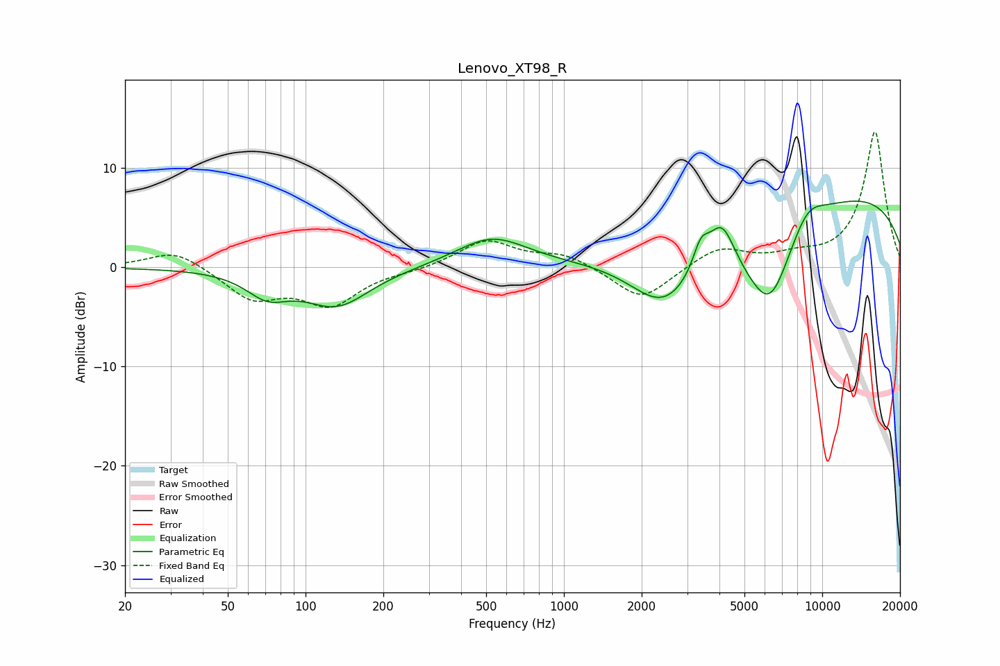

# Lenovo_XT98_R
See [usage instructions](https://github.com/jaakkopasanen/AutoEq#usage) for more options and info.

### Parametric EQs
Apply preamp of -6.8 dB when using parametric equalizer.

|   # | Type    |   Fc (Hz) |    Q |   Gain (dB) |
|-----|---------|-----------|------|-------------|
|   1 | Peaking |        71 | 1.73 |        -2.3 |
|   2 | Peaking |       132 | 1.11 |        -3.8 |
|   3 | Peaking |       526 | 1.02 |         3   |
|   4 | Peaking |      2437 | 1.05 |        -5.9 |
|   5 | Peaking |      3389 | 4.48 |         2.7 |
|   6 | Peaking |      4084 | 2.6  |         5.1 |
|   7 | Peaking |      5314 | 0.69 |        -4.5 |
|   8 | Peaking |      6290 | 1.67 |        -6.4 |
|   9 | Peaking |      8728 | 1.91 |         2.4 |
|  10 | Peaking |     10000 | 0.2  |         7.9 |

### Fixed Band EQs
When using fixed band (also called graphic) equalizer, apply preamp of **-13.7 dB** (if available) and set gains manually with these parameters.

|   # | Type    |   Fc (Hz) |    Q |   Gain (dB) |
|-----|---------|-----------|------|-------------|
|   1 | Peaking |        31 | 1.41 |         1.8 |
|   2 | Peaking |        62 | 1.41 |        -3   |
|   3 | Peaking |       125 | 1.41 |        -3.6 |
|   4 | Peaking |       250 | 1.41 |        -0.3 |
|   5 | Peaking |       500 | 1.41 |         2.7 |
|   6 | Peaking |      1000 | 1.41 |         1.3 |
|   7 | Peaking |      2000 | 1.41 |        -3.4 |
|   8 | Peaking |      4000 | 1.41 |         2   |
|   9 | Peaking |      8000 | 1.41 |         0.8 |
|  10 | Peaking |     16000 | 1.41 |        13.7 |

### Graphs

