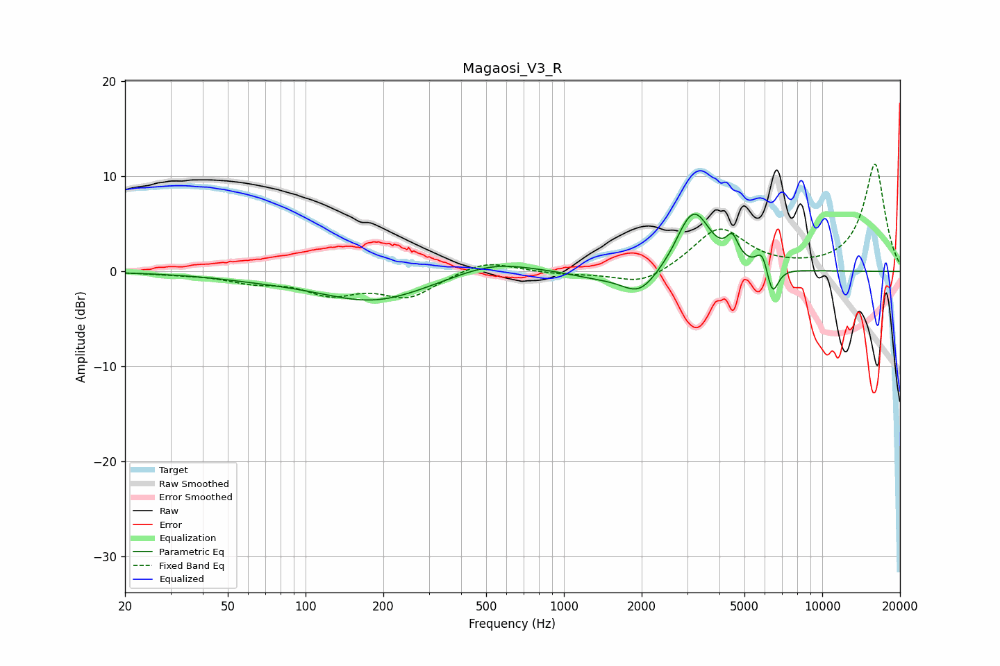

# Magaosi_V3_R
See [usage instructions](https://github.com/jaakkopasanen/AutoEq#usage) for more options and info.

### Parametric EQs
Apply preamp of -6.1 dB when using parametric equalizer.

|   # | Type    |   Fc (Hz) |    Q |   Gain (dB) |
|-----|---------|-----------|------|-------------|
|   1 | Peaking |        69 | 0.65 |        -0.5 |
|   2 | Peaking |       185 | 0.68 |        -3   |
|   3 | Peaking |       531 | 0.95 |         1.3 |
|   4 | Peaking |      1316 | 1.4  |        -0.6 |
|   5 | Peaking |      1962 | 1.99 |        -2.6 |
|   6 | Peaking |      2932 | 3.46 |         0.8 |
|   7 | Peaking |      3220 | 2.21 |         5.9 |
|   8 | Peaking |      4487 | 6    |         2.3 |
|   9 | Peaking |      5868 | 5.96 |         2.1 |
|  10 | Peaking |      6407 | 6    |        -3.2 |

### Fixed Band EQs
When using fixed band (also called graphic) equalizer, apply preamp of **-11.4 dB** (if available) and set gains manually with these parameters.

|   # | Type    |   Fc (Hz) |    Q |   Gain (dB) |
|-----|---------|-----------|------|-------------|
|   1 | Peaking |        31 | 1.41 |        -0.2 |
|   2 | Peaking |        62 | 1.41 |        -0.9 |
|   3 | Peaking |       125 | 1.41 |        -2.1 |
|   4 | Peaking |       250 | 1.41 |        -2.5 |
|   5 | Peaking |       500 | 1.41 |         1.3 |
|   6 | Peaking |      1000 | 1.41 |        -0.3 |
|   7 | Peaking |      2000 | 1.41 |        -1.6 |
|   8 | Peaking |      4000 | 1.41 |         4.6 |
|   9 | Peaking |      8000 | 1.41 |         0.1 |
|  10 | Peaking |     16000 | 1.41 |        11.3 |

### Graphs

