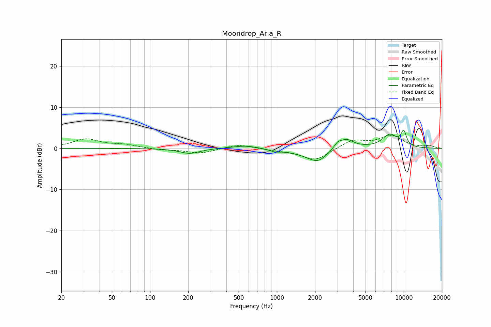

# Moondrop_Aria_R
See [usage instructions](https://github.com/jaakkopasanen/AutoEq#usage) for more options and info.

### Parametric EQs
Apply preamp of -4.5 dB when using parametric equalizer.

|   # | Type    |   Fc (Hz) |    Q |   Gain (dB) |
|-----|---------|-----------|------|-------------|
|   1 | Peaking |       206 | 1.83 |        -1.3 |
|   2 | Peaking |       566 | 1.35 |         0.8 |
|   3 | Peaking |       961 | 3.53 |        -0.5 |
|   4 | Peaking |      1532 | 1.01 |        -0.7 |
|   5 | Peaking |      2112 | 1.76 |        -3   |
|   6 | Peaking |      3002 | 6    |         0.6 |
|   7 | Peaking |      3337 | 6    |        -0.3 |
|   8 | Peaking |      3402 | 2.2  |         3   |
|   9 | Peaking |      7763 | 2.18 |         3.2 |
|  10 | Peaking |     10000 | 5.47 |         3.4 |

### Fixed Band EQs
When using fixed band (also called graphic) equalizer, apply preamp of **-3.3 dB** (if available) and set gains manually with these parameters.

|   # | Type    |   Fc (Hz) |    Q |   Gain (dB) |
|-----|---------|-----------|------|-------------|
|   1 | Peaking |        31 | 1.41 |         2.2 |
|   2 | Peaking |        62 | 1.41 |         0.8 |
|   3 | Peaking |       125 | 1.41 |        -0.4 |
|   4 | Peaking |       250 | 1.41 |        -1.2 |
|   5 | Peaking |       500 | 1.41 |         1   |
|   6 | Peaking |      1000 | 1.41 |        -0.4 |
|   7 | Peaking |      2000 | 1.41 |        -3   |
|   8 | Peaking |      4000 | 1.41 |         2   |
|   9 | Peaking |      8000 | 1.41 |         2.9 |
|  10 | Peaking |     16000 | 1.41 |         0.5 |

### Graphs

