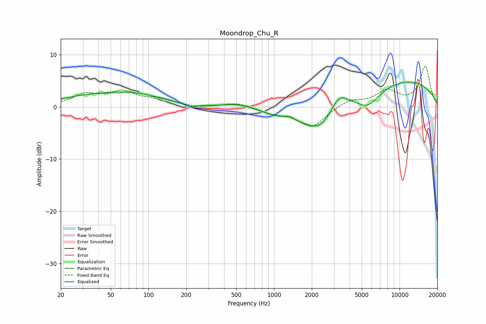

# Moondrop_Chu_R
See [usage instructions](https://github.com/jaakkopasanen/AutoEq#usage) for more options and info.

### Parametric EQs
Apply preamp of -4.8 dB when using parametric equalizer.

|   # | Type    |   Fc (Hz) |    Q |   Gain (dB) |
|-----|---------|-----------|------|-------------|
|   1 | Peaking |        41 | 0.46 |         2.2 |
|   2 | Peaking |        87 | 0.78 |         1.2 |
|   3 | Peaking |       221 | 3.71 |        -0.6 |
|   4 | Peaking |       532 | 1.07 |         1.3 |
|   5 | Peaking |      1329 | 5.53 |         0.5 |
|   6 | Peaking |      2304 | 1.22 |        -3.9 |
|   7 | Peaking |      2384 | 0.27 |        -2.6 |
|   8 | Peaking |      3300 | 2.08 |         3.2 |
|   9 | Peaking |      5636 | 1.59 |        -2.8 |
|  10 | Peaking |      9193 | 0.28 |         5.9 |

### Fixed Band EQs
When using fixed band (also called graphic) equalizer, apply preamp of **-7.9 dB** (if available) and set gains manually with these parameters.

|   # | Type    |   Fc (Hz) |    Q |   Gain (dB) |
|-----|---------|-----------|------|-------------|
|   1 | Peaking |        31 | 1.41 |         2.2 |
|   2 | Peaking |        62 | 1.41 |         2.6 |
|   3 | Peaking |       125 | 1.41 |         1.3 |
|   4 | Peaking |       250 | 1.41 |        -0.3 |
|   5 | Peaking |       500 | 1.41 |         0.8 |
|   6 | Peaking |      1000 | 1.41 |        -1.1 |
|   7 | Peaking |      2000 | 1.41 |        -3.8 |
|   8 | Peaking |      4000 | 1.41 |         1.3 |
|   9 | Peaking |      8000 | 1.41 |         2.9 |
|  10 | Peaking |     16000 | 1.41 |         7.7 |

### Graphs

