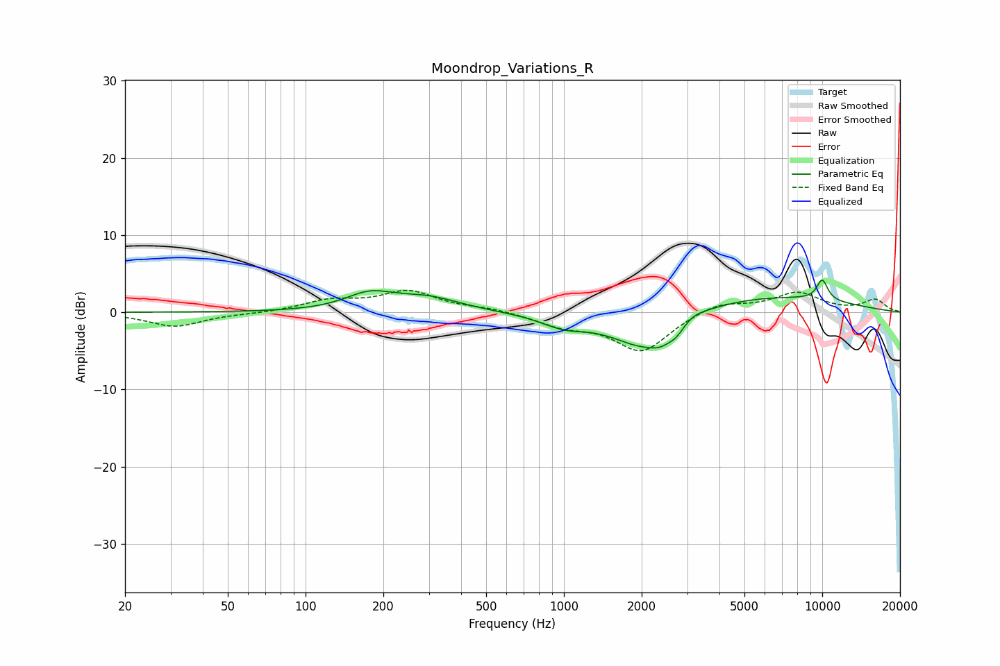

# Moondrop_Variations_R
See [usage instructions](https://github.com/jaakkopasanen/AutoEq#usage) for more options and info.

### Parametric EQs
Apply preamp of -4.3 dB when using parametric equalizer.

|   # | Type    |   Fc (Hz) |    Q |   Gain (dB) |
|-----|---------|-----------|------|-------------|
|   1 | Peaking |       177 | 1.51 |         2.1 |
|   2 | Peaking |       298 | 1.09 |         1.7 |
|   3 | Peaking |      1005 | 1.52 |        -1.5 |
|   4 | Peaking |      2019 | 1.09 |        -4.7 |
|   5 | Peaking |      2374 | 3.12 |        -1.3 |
|   6 | Peaking |      2724 | 4.46 |        -1.1 |
|   7 | Peaking |      3153 | 3.23 |         0.6 |
|   8 | Peaking |      5677 | 0.38 |         2.2 |
|   9 | Peaking |     10000 | 5.34 |         1.5 |
|  10 | Peaking |     10000 | 5.79 |         1.2 |

### Fixed Band EQs
When using fixed band (also called graphic) equalizer, apply preamp of **-2.9 dB** (if available) and set gains manually with these parameters.

|   # | Type    |   Fc (Hz) |    Q |   Gain (dB) |
|-----|---------|-----------|------|-------------|
|   1 | Peaking |        31 | 1.41 |        -1.8 |
|   2 | Peaking |        62 | 1.41 |        -0.1 |
|   3 | Peaking |       125 | 1.41 |         1.4 |
|   4 | Peaking |       250 | 1.41 |         2.6 |
|   5 | Peaking |       500 | 1.41 |         0.5 |
|   6 | Peaking |      1000 | 1.41 |        -1.5 |
|   7 | Peaking |      2000 | 1.41 |        -5   |
|   8 | Peaking |      4000 | 1.41 |         1.4 |
|   9 | Peaking |      8000 | 1.41 |         2.5 |
|  10 | Peaking |     16000 | 1.41 |         1.6 |

### Graphs

