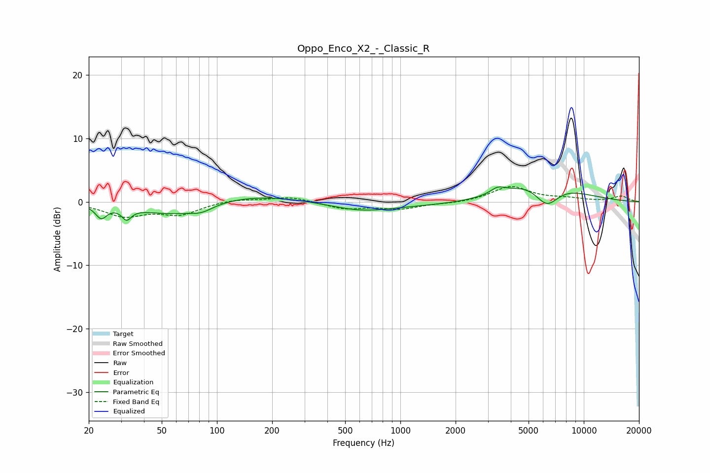

# Oppo_Enco_X2_-_Classic_R
See [usage instructions](https://github.com/jaakkopasanen/AutoEq#usage) for more options and info.

### Parametric EQs
Apply preamp of -2.5 dB when using parametric equalizer.

|   # | Type    |   Fc (Hz) |    Q |   Gain (dB) |
|-----|---------|-----------|------|-------------|
|   1 | Peaking |        23 | 4.76 |        -2   |
|   2 | Peaking |        32 | 5.62 |        -1.7 |
|   3 | Peaking |        58 | 0.7  |        -2.6 |
|   4 | Peaking |        82 | 2.21 |        -0.9 |
|   5 | Peaking |       129 | 0.38 |         1.7 |
|   6 | Peaking |       607 | 0.88 |        -1.1 |
|   7 | Peaking |      1093 | 0.23 |        -0.7 |
|   8 | Peaking |      3393 | 3.62 |         1   |
|   9 | Peaking |      5782 | 0.74 |         4.3 |
|  10 | Peaking |      6281 | 1.95 |        -4.2 |

### Fixed Band EQs
When using fixed band (also called graphic) equalizer, apply preamp of **-2.5 dB** (if available) and set gains manually with these parameters.

|   # | Type    |   Fc (Hz) |    Q |   Gain (dB) |
|-----|---------|-----------|------|-------------|
|   1 | Peaking |        31 | 1.41 |        -2.1 |
|   2 | Peaking |        62 | 1.41 |        -1.9 |
|   3 | Peaking |       125 | 1.41 |         0.5 |
|   4 | Peaking |       250 | 1.41 |         0.8 |
|   5 | Peaking |       500 | 1.41 |        -1.1 |
|   6 | Peaking |      1000 | 1.41 |        -1   |
|   7 | Peaking |      2000 | 1.41 |        -0.2 |
|   8 | Peaking |      4000 | 1.41 |         2.4 |
|   9 | Peaking |      8000 | 1.41 |         0.4 |
|  10 | Peaking |     16000 | 1.41 |         0.9 |

### Graphs

