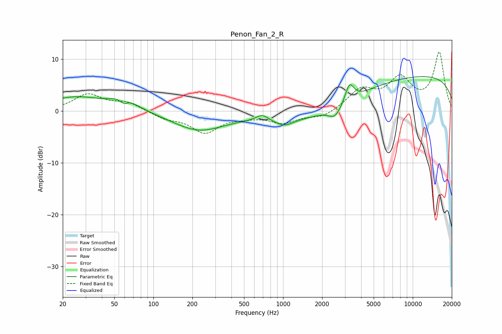

# Penon_Fan_2_R
See [usage instructions](https://github.com/jaakkopasanen/AutoEq#usage) for more options and info.

### Parametric EQs
Apply preamp of -6.7 dB when using parametric equalizer.

|   # | Type    |   Fc (Hz) |    Q |   Gain (dB) |
|-----|---------|-----------|------|-------------|
|   1 | Peaking |        25 | 0.67 |         2.6 |
|   2 | Peaking |        59 | 4.69 |        -1.1 |
|   3 | Peaking |        59 | 1.41 |         2.1 |
|   4 | Peaking |       224 | 0.7  |        -3.6 |
|   5 | Peaking |       688 | 3.15 |         1.2 |
|   6 | Peaking |      1023 | 2.17 |        -1.2 |
|   7 | Peaking |      1944 | 0.39 |        -3.3 |
|   8 | Peaking |      2517 | 2.9  |        -2.2 |
|   9 | Peaking |      3254 | 4.36 |         3.5 |
|  10 | Peaking |      9957 | 0.18 |         7   |

### Fixed Band EQs
When using fixed band (also called graphic) equalizer, apply preamp of **-11.5 dB** (if available) and set gains manually with these parameters.

|   # | Type    |   Fc (Hz) |    Q |   Gain (dB) |
|-----|---------|-----------|------|-------------|
|   1 | Peaking |        31 | 1.41 |         3.1 |
|   2 | Peaking |        62 | 1.41 |         1.6 |
|   3 | Peaking |       125 | 1.41 |        -1.3 |
|   4 | Peaking |       250 | 1.41 |        -3.9 |
|   5 | Peaking |       500 | 1.41 |        -0.8 |
|   6 | Peaking |      1000 | 1.41 |        -2.1 |
|   7 | Peaking |      2000 | 1.41 |        -1.3 |
|   8 | Peaking |      4000 | 1.41 |         3.9 |
|   9 | Peaking |      8000 | 1.41 |         5.8 |
|  10 | Peaking |     16000 | 1.41 |        11.1 |

### Graphs

