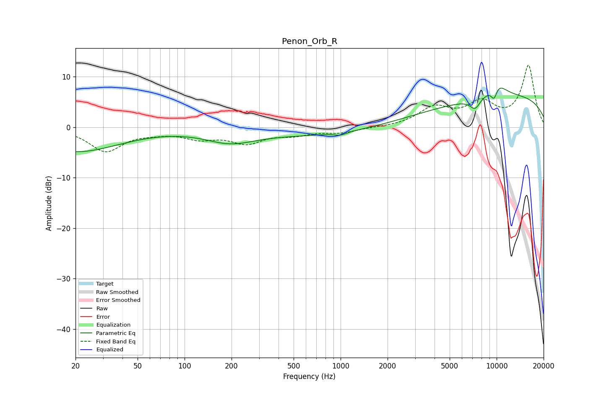

# Penon_Orb_R
See [usage instructions](https://github.com/jaakkopasanen/AutoEq#usage) for more options and info.

### Parametric EQs
Apply preamp of -7.9 dB when using parametric equalizer.

|   # | Type    |   Fc (Hz) |    Q |   Gain (dB) |
|-----|---------|-----------|------|-------------|
|   1 | Peaking |        20 | 0.49 |        -4.8 |
|   2 | Peaking |       195 | 0.88 |        -2.5 |
|   3 | Peaking |       996 | 3.57 |        -0.6 |
|   4 | Peaking |      1515 | 0.18 |        -1.9 |
|   5 | Peaking |      7271 | 4.44 |        -1.3 |
|   6 | Peaking |      7311 | 3.31 |        -0.9 |
|   7 | Peaking |      9646 | 5.75 |        -3.1 |
|   8 | Peaking |      9772 | 5.84 |         0.4 |
|   9 | Peaking |     10000 | 2.05 |         2.9 |
|  10 | Peaking |     10000 | 0.2  |         6.6 |

### Fixed Band EQs
When using fixed band (also called graphic) equalizer, apply preamp of **-12.4 dB** (if available) and set gains manually with these parameters.

|   # | Type    |   Fc (Hz) |    Q |   Gain (dB) |
|-----|---------|-----------|------|-------------|
|   1 | Peaking |        31 | 1.41 |        -4.7 |
|   2 | Peaking |        62 | 1.41 |        -0.7 |
|   3 | Peaking |       125 | 1.41 |        -1.9 |
|   4 | Peaking |       250 | 1.41 |        -2.8 |
|   5 | Peaking |       500 | 1.41 |        -1.2 |
|   6 | Peaking |      1000 | 1.41 |        -1   |
|   7 | Peaking |      2000 | 1.41 |        -0.1 |
|   8 | Peaking |      4000 | 1.41 |         3.6 |
|   9 | Peaking |      8000 | 1.41 |         4.4 |
|  10 | Peaking |     16000 | 1.41 |        12.1 |

### Graphs

