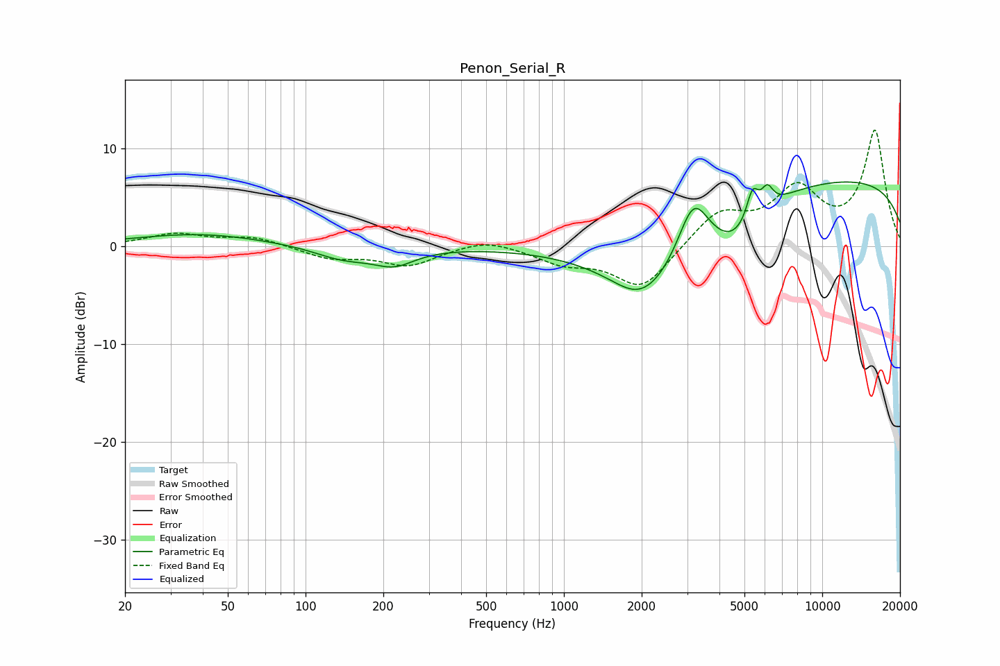

# Penon_Serial_R
See [usage instructions](https://github.com/jaakkopasanen/AutoEq#usage) for more options and info.

### Parametric EQs
Apply preamp of -6.7 dB when using parametric equalizer.

|   # | Type    |   Fc (Hz) |    Q |   Gain (dB) |
|-----|---------|-----------|------|-------------|
|   1 | Peaking |        39 | 0.57 |         1.3 |
|   2 | Peaking |       140 | 1.26 |        -1.3 |
|   3 | Peaking |       220 | 1.74 |        -1.6 |
|   4 | Peaking |      1923 | 1.62 |        -1.4 |
|   5 | Peaking |      2278 | 0.72 |        -7.3 |
|   6 | Peaking |      3169 | 2.24 |         6.3 |
|   7 | Peaking |      4571 | 1.37 |        -3.2 |
|   8 | Peaking |      5371 | 5.89 |         3.1 |
|   9 | Peaking |      6127 | 5.98 |         2   |
|  10 | Peaking |     10000 | 0.18 |         7   |

### Fixed Band EQs
When using fixed band (also called graphic) equalizer, apply preamp of **-11.9 dB** (if available) and set gains manually with these parameters.

|   # | Type    |   Fc (Hz) |    Q |   Gain (dB) |
|-----|---------|-----------|------|-------------|
|   1 | Peaking |        31 | 1.41 |         1.2 |
|   2 | Peaking |        62 | 1.41 |         0.9 |
|   3 | Peaking |       125 | 1.41 |        -1.2 |
|   4 | Peaking |       250 | 1.41 |        -1.9 |
|   5 | Peaking |       500 | 1.41 |         0.9 |
|   6 | Peaking |      1000 | 1.41 |        -1.5 |
|   7 | Peaking |      2000 | 1.41 |        -4.4 |
|   8 | Peaking |      4000 | 1.41 |         3.4 |
|   9 | Peaking |      8000 | 1.41 |         5.4 |
|  10 | Peaking |     16000 | 1.41 |        11.6 |

### Graphs

