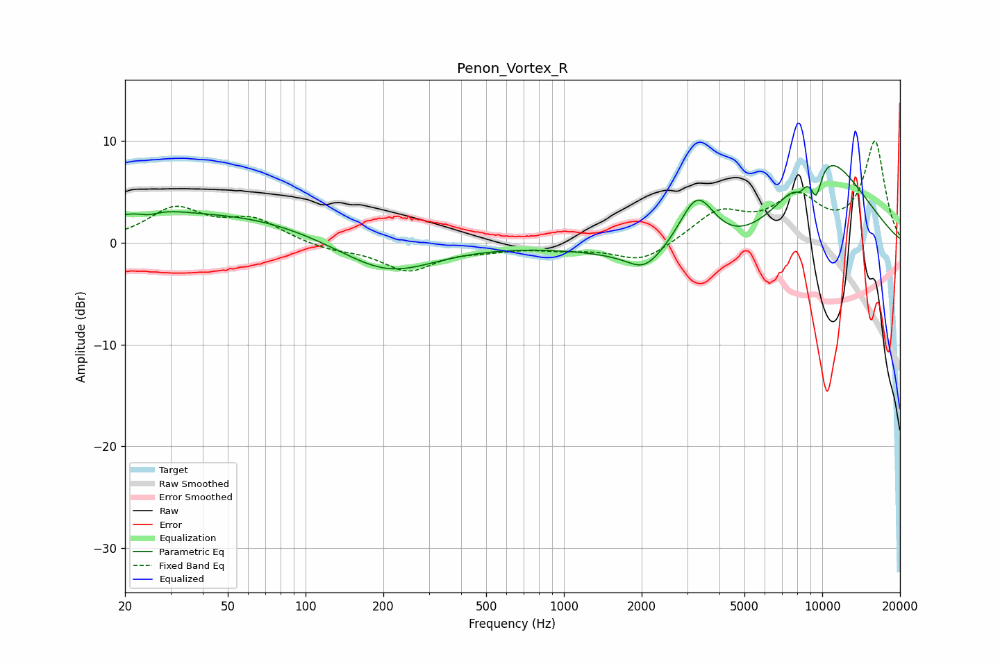

# Penon_Vortex_R
See [usage instructions](https://github.com/jaakkopasanen/AutoEq#usage) for more options and info.

### Parametric EQs
Apply preamp of -7.7 dB when using parametric equalizer.

|   # | Type    |   Fc (Hz) |    Q |   Gain (dB) |
|-----|---------|-----------|------|-------------|
|   1 | Peaking |        23 | 0.81 |         2.3 |
|   2 | Peaking |        25 | 3.54 |        -0.5 |
|   3 | Peaking |        60 | 0.51 |         2.2 |
|   4 | Peaking |       208 | 0.78 |        -3.2 |
|   5 | Peaking |      2049 | 2.16 |        -1.8 |
|   6 | Peaking |      3279 | 1.88 |         6.3 |
|   7 | Peaking |      4509 | 0.44 |        -4.4 |
|   8 | Peaking |      8225 | 5.62 |        -1   |
|   9 | Peaking |      9476 | 5.62 |        -3.2 |
|  10 | Peaking |      9780 | 0.63 |        10.4 |

### Fixed Band EQs
When using fixed band (also called graphic) equalizer, apply preamp of **-10.1 dB** (if available) and set gains manually with these parameters.

|   # | Type    |   Fc (Hz) |    Q |   Gain (dB) |
|-----|---------|-----------|------|-------------|
|   1 | Peaking |        31 | 1.41 |         3.2 |
|   2 | Peaking |        62 | 1.41 |         2.1 |
|   3 | Peaking |       125 | 1.41 |        -0.6 |
|   4 | Peaking |       250 | 1.41 |        -2.6 |
|   5 | Peaking |       500 | 1.41 |        -0.5 |
|   6 | Peaking |      1000 | 1.41 |        -0.5 |
|   7 | Peaking |      2000 | 1.41 |        -1.9 |
|   8 | Peaking |      4000 | 1.41 |         2.9 |
|   9 | Peaking |      8000 | 1.41 |         4   |
|  10 | Peaking |     16000 | 1.41 |         9.8 |

### Graphs

