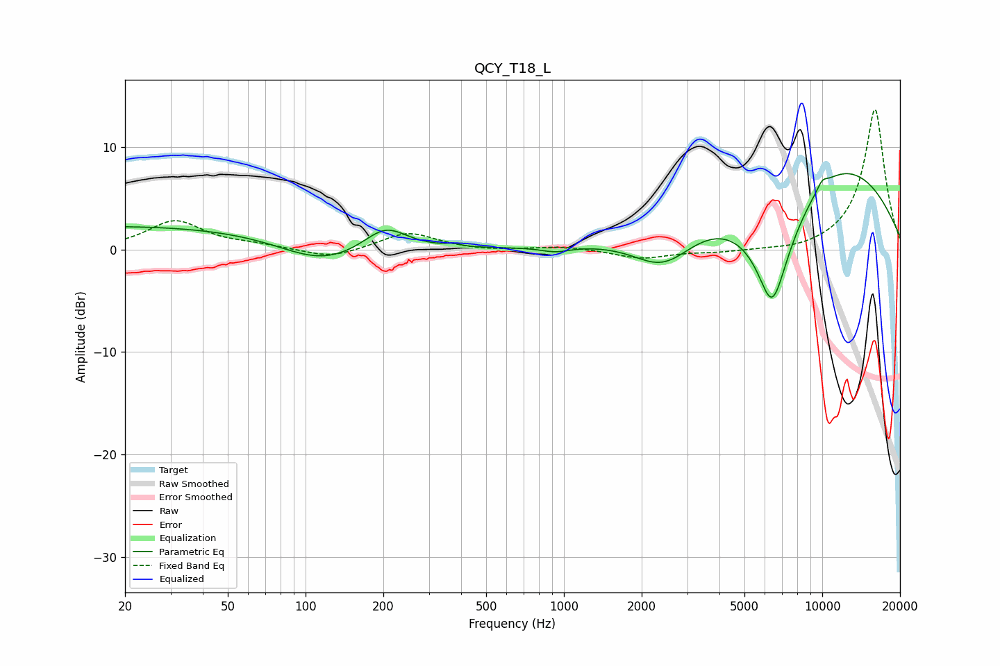

# QCY_T18_L
See [usage instructions](https://github.com/jaakkopasanen/AutoEq#usage) for more options and info.

### Parametric EQs
Apply preamp of -7.5 dB when using parametric equalizer.

|   # | Type    |   Fc (Hz) |    Q |   Gain (dB) |
|-----|---------|-----------|------|-------------|
|   1 | Peaking |        21 | 0.18 |         2.3 |
|   2 | Peaking |       116 | 0.86 |        -2.3 |
|   3 | Peaking |       204 | 1.68 |         2.4 |
|   4 | Peaking |       370 | 5.13 |         0.3 |
|   5 | Peaking |       929 | 2.46 |        -0.5 |
|   6 | Peaking |      2431 | 1.14 |        -4   |
|   7 | Peaking |      6391 | 2.85 |        -5.3 |
|   8 | Peaking |      6565 | 0.94 |        -9.1 |
|   9 | Peaking |      8931 | 0.31 |        11   |
|  10 | Peaking |     10000 | 6    |         0.7 |

### Fixed Band EQs
When using fixed band (also called graphic) equalizer, apply preamp of **-13.7 dB** (if available) and set gains manually with these parameters.

|   # | Type    |   Fc (Hz) |    Q |   Gain (dB) |
|-----|---------|-----------|------|-------------|
|   1 | Peaking |        31 | 1.41 |         2.8 |
|   2 | Peaking |        62 | 1.41 |         0.4 |
|   3 | Peaking |       125 | 1.41 |        -0.9 |
|   4 | Peaking |       250 | 1.41 |         1.7 |
|   5 | Peaking |       500 | 1.41 |        -0.2 |
|   6 | Peaking |      1000 | 1.41 |         0.3 |
|   7 | Peaking |      2000 | 1.41 |        -0.9 |
|   8 | Peaking |      4000 | 1.41 |        -0.3 |
|   9 | Peaking |      8000 | 1.41 |        -0.3 |
|  10 | Peaking |     16000 | 1.41 |        13.8 |

### Graphs

