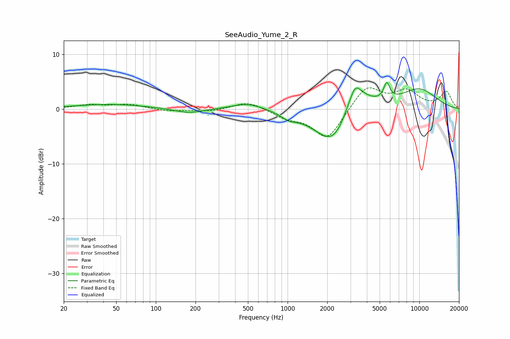

# SeeAudio_Yume_2_R
See [usage instructions](https://github.com/jaakkopasanen/AutoEq#usage) for more options and info.

### Parametric EQs
Apply preamp of -5.0 dB when using parametric equalizer.

|   # | Type    |   Fc (Hz) |    Q |   Gain (dB) |
|-----|---------|-----------|------|-------------|
|   1 | Peaking |        45 | 0.5  |         0.9 |
|   2 | Peaking |       178 | 1.29 |        -0.9 |
|   3 | Peaking |       499 | 1.19 |         1.2 |
|   4 | Peaking |      1024 | 2.45 |        -1   |
|   5 | Peaking |      2011 | 0.89 |        -2.9 |
|   6 | Peaking |      2316 | 1.27 |        -5   |
|   7 | Peaking |      3207 | 1.36 |         5.7 |
|   8 | Peaking |      3258 | 4.02 |         1.8 |
|   9 | Peaking |      5662 | 6    |         3   |
|  10 | Peaking |      9912 | 0.83 |         3.6 |

### Fixed Band EQs
When using fixed band (also called graphic) equalizer, apply preamp of **-4.0 dB** (if available) and set gains manually with these parameters.

|   # | Type    |   Fc (Hz) |    Q |   Gain (dB) |
|-----|---------|-----------|------|-------------|
|   1 | Peaking |        31 | 1.41 |         0.7 |
|   2 | Peaking |        62 | 1.41 |         0.8 |
|   3 | Peaking |       125 | 1.41 |        -0.4 |
|   4 | Peaking |       250 | 1.41 |        -0.4 |
|   5 | Peaking |       500 | 1.41 |         1.5 |
|   6 | Peaking |      1000 | 1.41 |        -1.4 |
|   7 | Peaking |      2000 | 1.41 |        -5.6 |
|   8 | Peaking |      4000 | 1.41 |         4.4 |
|   9 | Peaking |      8000 | 1.41 |         3.1 |
|  10 | Peaking |     16000 | 1.41 |         3.1 |

### Graphs

