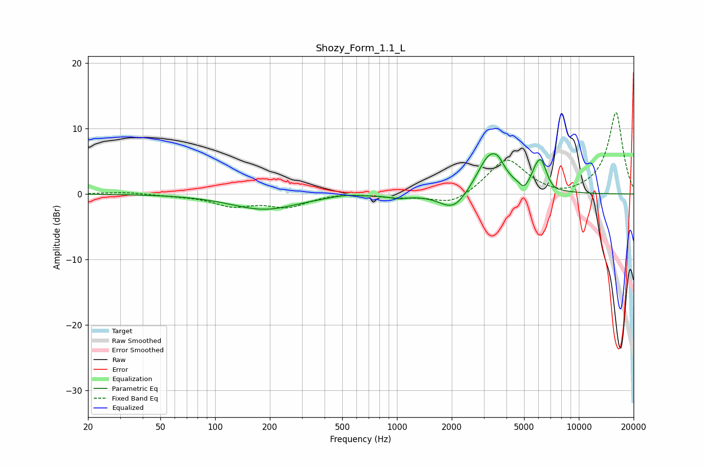

# Shozy_Form_1.1_L
See [usage instructions](https://github.com/jaakkopasanen/AutoEq#usage) for more options and info.

### Parametric EQs
Apply preamp of -6.3 dB when using parametric equalizer.

|   # | Type    |   Fc (Hz) |    Q |   Gain (dB) |
|-----|---------|-----------|------|-------------|
|   1 | Peaking |       186 | 0.77 |        -2.3 |
|   2 | Peaking |       512 | 2.07 |         0.3 |
|   3 | Peaking |      1020 | 2.83 |        -0.5 |
|   4 | Peaking |      2053 | 1.82 |        -3   |
|   5 | Peaking |      3234 | 1.97 |         6.1 |
|   6 | Peaking |      3613 | 4.59 |         1.1 |
|   7 | Peaking |      4988 | 6    |        -1.1 |
|   8 | Peaking |      5750 | 5.97 |         1   |
|   9 | Peaking |      6194 | 4.32 |         4.3 |
|  10 | Peaking |      7359 | 5.03 |        -0.4 |

### Fixed Band EQs
When using fixed band (also called graphic) equalizer, apply preamp of **-12.5 dB** (if available) and set gains manually with these parameters.

|   # | Type    |   Fc (Hz) |    Q |   Gain (dB) |
|-----|---------|-----------|------|-------------|
|   1 | Peaking |        31 | 1.41 |         0.3 |
|   2 | Peaking |        62 | 1.41 |        -0.2 |
|   3 | Peaking |       125 | 1.41 |        -1.7 |
|   4 | Peaking |       250 | 1.41 |        -1.8 |
|   5 | Peaking |       500 | 1.41 |         0.2 |
|   6 | Peaking |      1000 | 1.41 |        -0.4 |
|   7 | Peaking |      2000 | 1.41 |        -1.8 |
|   8 | Peaking |      4000 | 1.41 |         5.4 |
|   9 | Peaking |      8000 | 1.41 |        -0.7 |
|  10 | Peaking |     16000 | 1.41 |        12.5 |

### Graphs

