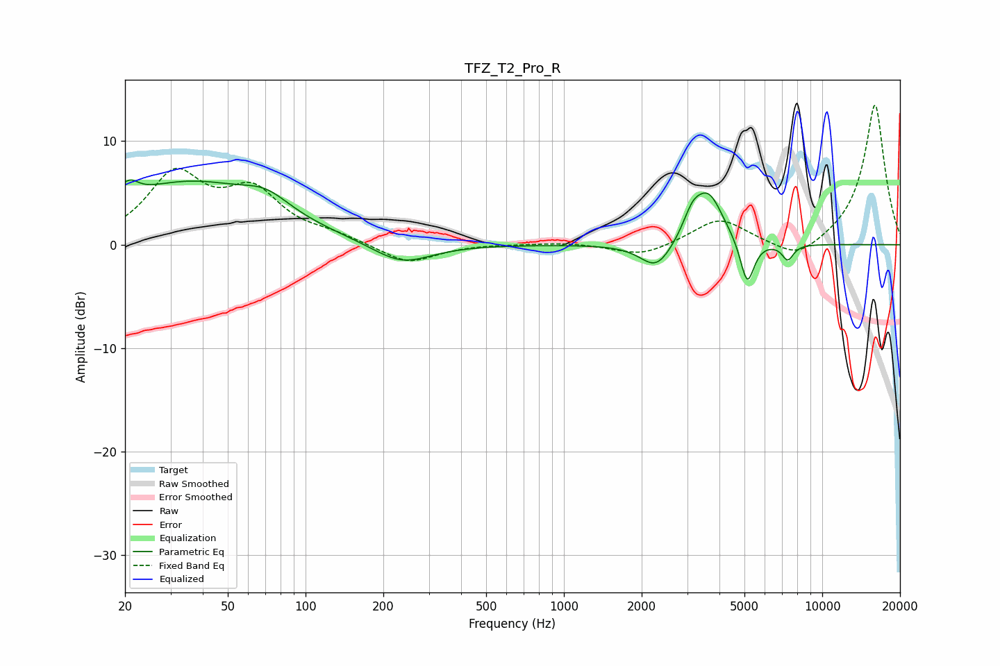

# TFZ_T2_Pro_R
See [usage instructions](https://github.com/jaakkopasanen/AutoEq#usage) for more options and info.

### Parametric EQs
Apply preamp of -6.4 dB when using parametric equalizer.

|   # | Type    |   Fc (Hz) |    Q |   Gain (dB) |
|-----|---------|-----------|------|-------------|
|   1 | Peaking |        20 | 5.97 |        -2.3 |
|   2 | Peaking |        20 | 4.79 |         3.9 |
|   3 | Peaking |        35 | 0.47 |         5.8 |
|   4 | Peaking |        71 | 1.58 |         1.6 |
|   5 | Peaking |       235 | 1.23 |        -2.1 |
|   6 | Peaking |      2284 | 2.27 |        -2.6 |
|   7 | Peaking |      3132 | 4.08 |         1.8 |
|   8 | Peaking |      3621 | 2.38 |         4.9 |
|   9 | Peaking |      5123 | 5.14 |        -4.4 |
|  10 | Peaking |      7354 | 6    |        -1.5 |

### Fixed Band EQs
When using fixed band (also called graphic) equalizer, apply preamp of **-13.6 dB** (if available) and set gains manually with these parameters.

|   # | Type    |   Fc (Hz) |    Q |   Gain (dB) |
|-----|---------|-----------|------|-------------|
|   1 | Peaking |        31 | 1.41 |         6.5 |
|   2 | Peaking |        62 | 1.41 |         4.7 |
|   3 | Peaking |       125 | 1.41 |         0.7 |
|   4 | Peaking |       250 | 1.41 |        -1.9 |
|   5 | Peaking |       500 | 1.41 |         0.1 |
|   6 | Peaking |      1000 | 1.41 |         0.2 |
|   7 | Peaking |      2000 | 1.41 |        -1.2 |
|   8 | Peaking |      4000 | 1.41 |         2.5 |
|   9 | Peaking |      8000 | 1.41 |        -1.8 |
|  10 | Peaking |     16000 | 1.41 |        13.6 |

### Graphs

