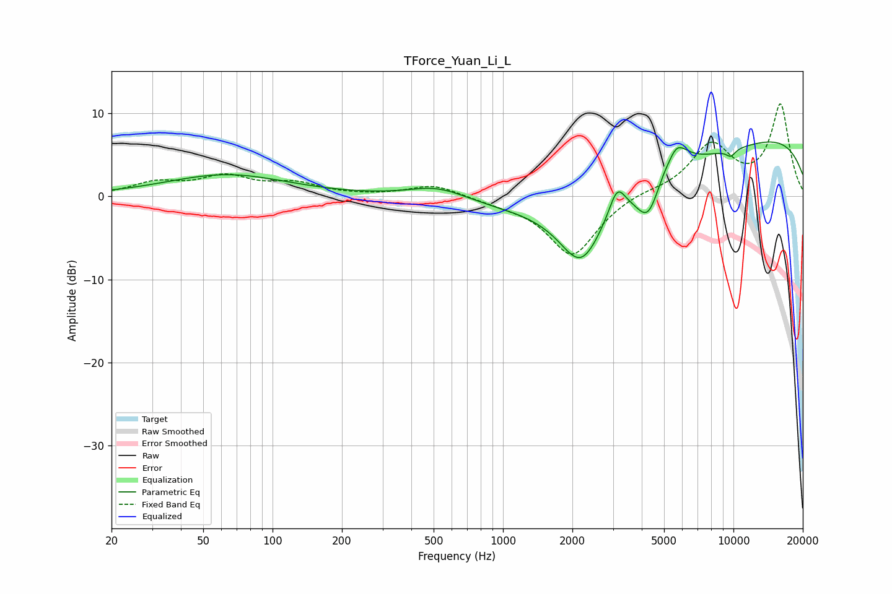

# TForce_Yuan_Li_L
See [usage instructions](https://github.com/jaakkopasanen/AutoEq#usage) for more options and info.

### Parametric EQs
Apply preamp of -6.6 dB when using parametric equalizer.

|   # | Type    |   Fc (Hz) |    Q |   Gain (dB) |
|-----|---------|-----------|------|-------------|
|   1 | Peaking |        63 | 0.54 |         2.6 |
|   2 | Peaking |       522 | 1.09 |         1.6 |
|   3 | Peaking |      2187 | 1.44 |        -7.9 |
|   4 | Peaking |      3129 | 4.1  |         3.3 |
|   5 | Peaking |      4278 | 2.68 |        -4.9 |
|   6 | Peaking |      4283 | 0.23 |        -6.5 |
|   7 | Peaking |      5304 | 4.56 |        -1.5 |
|   8 | Peaking |      5465 | 2.6  |         5   |
|   9 | Peaking |      8853 | 0.19 |        10.8 |
|  10 | Peaking |      9744 | 6    |        -0.8 |

### Fixed Band EQs
When using fixed band (also called graphic) equalizer, apply preamp of **-11.2 dB** (if available) and set gains manually with these parameters.

|   # | Type    |   Fc (Hz) |    Q |   Gain (dB) |
|-----|---------|-----------|------|-------------|
|   1 | Peaking |        31 | 1.41 |         1.5 |
|   2 | Peaking |        62 | 1.41 |         2.2 |
|   3 | Peaking |       125 | 1.41 |         1.4 |
|   4 | Peaking |       250 | 1.41 |         0   |
|   5 | Peaking |       500 | 1.41 |         1.4 |
|   6 | Peaking |      1000 | 1.41 |        -0.6 |
|   7 | Peaking |      2000 | 1.41 |        -7.2 |
|   8 | Peaking |      4000 | 1.41 |         0.6 |
|   9 | Peaking |      8000 | 1.41 |         6   |
|  10 | Peaking |     16000 | 1.41 |        10.9 |

### Graphs

