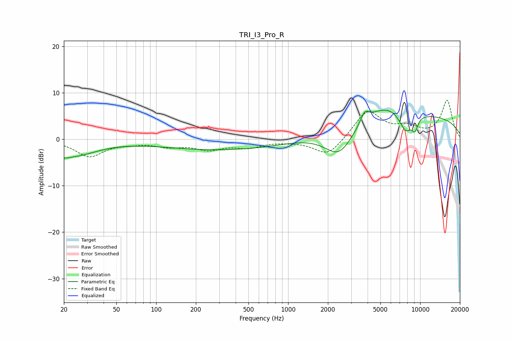

# TRI_I3_Pro_R
See [usage instructions](https://github.com/jaakkopasanen/AutoEq#usage) for more options and info.

### Parametric EQs
Apply preamp of -6.3 dB when using parametric equalizer.

|   # | Type    |   Fc (Hz) |    Q |   Gain (dB) |
|-----|---------|-----------|------|-------------|
|   1 | Peaking |        20 | 3.52 |        -0.7 |
|   2 | Peaking |        23 | 0.79 |        -3.4 |
|   3 | Peaking |       339 | 0.28 |        -2.3 |
|   4 | Peaking |      2433 | 1.24 |        -6.5 |
|   5 | Peaking |      3798 | 4.16 |         2.5 |
|   6 | Peaking |      5408 | 0.91 |         2.9 |
|   7 | Peaking |      6944 | 3.72 |        -0.2 |
|   8 | Peaking |      7778 | 2.83 |        -4.1 |
|   9 | Peaking |      8305 | 0.18 |         5.1 |
|  10 | Peaking |      9127 | 5.44 |        -2.7 |

### Fixed Band EQs
When using fixed band (also called graphic) equalizer, apply preamp of **-8.5 dB** (if available) and set gains manually with these parameters.

|   # | Type    |   Fc (Hz) |    Q |   Gain (dB) |
|-----|---------|-----------|------|-------------|
|   1 | Peaking |        31 | 1.41 |        -3.6 |
|   2 | Peaking |        62 | 1.41 |        -0.6 |
|   3 | Peaking |       125 | 1.41 |        -1.3 |
|   4 | Peaking |       250 | 1.41 |        -2   |
|   5 | Peaking |       500 | 1.41 |        -1.5 |
|   6 | Peaking |      1000 | 1.41 |        -0.2 |
|   7 | Peaking |      2000 | 1.41 |        -3.8 |
|   8 | Peaking |      4000 | 1.41 |         6.2 |
|   9 | Peaking |      8000 | 1.41 |         2.1 |
|  10 | Peaking |     16000 | 1.41 |         8.3 |

### Graphs

