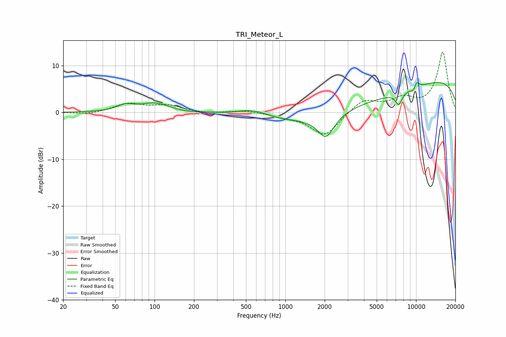

# TRI_Meteor_L
See [usage instructions](https://github.com/jaakkopasanen/AutoEq#usage) for more options and info.

### Parametric EQs
Apply preamp of -6.5 dB when using parametric equalizer.

|   # | Type    |   Fc (Hz) |    Q |   Gain (dB) |
|-----|---------|-----------|------|-------------|
|   1 | Peaking |        60 | 2.16 |         1.3 |
|   2 | Peaking |       101 | 1.29 |         1.9 |
|   3 | Peaking |       168 | 2.04 |        -0.2 |
|   4 | Peaking |       564 | 1.26 |         1.5 |
|   5 | Peaking |      2045 | 2.27 |        -4.9 |
|   6 | Peaking |      3555 | 0.22 |        -5.6 |
|   7 | Peaking |      7369 | 5.27 |        -2.5 |
|   8 | Peaking |      9234 | 0.18 |         9.2 |
|   9 | Peaking |      9730 | 5.59 |        -1.9 |
|  10 | Peaking |     10000 | 5.98 |         2.5 |

### Fixed Band EQs
When using fixed band (also called graphic) equalizer, apply preamp of **-13.0 dB** (if available) and set gains manually with these parameters.

|   # | Type    |   Fc (Hz) |    Q |   Gain (dB) |
|-----|---------|-----------|------|-------------|
|   1 | Peaking |        31 | 1.41 |        -0.4 |
|   2 | Peaking |        62 | 1.41 |         1.8 |
|   3 | Peaking |       125 | 1.41 |         1.4 |
|   4 | Peaking |       250 | 1.41 |        -0.2 |
|   5 | Peaking |       500 | 1.41 |         0.5 |
|   6 | Peaking |      1000 | 1.41 |        -0.7 |
|   7 | Peaking |      2000 | 1.41 |        -5   |
|   8 | Peaking |      4000 | 1.41 |         2.8 |
|   9 | Peaking |      8000 | 1.41 |         2.6 |
|  10 | Peaking |     16000 | 1.41 |        12.8 |

### Graphs

