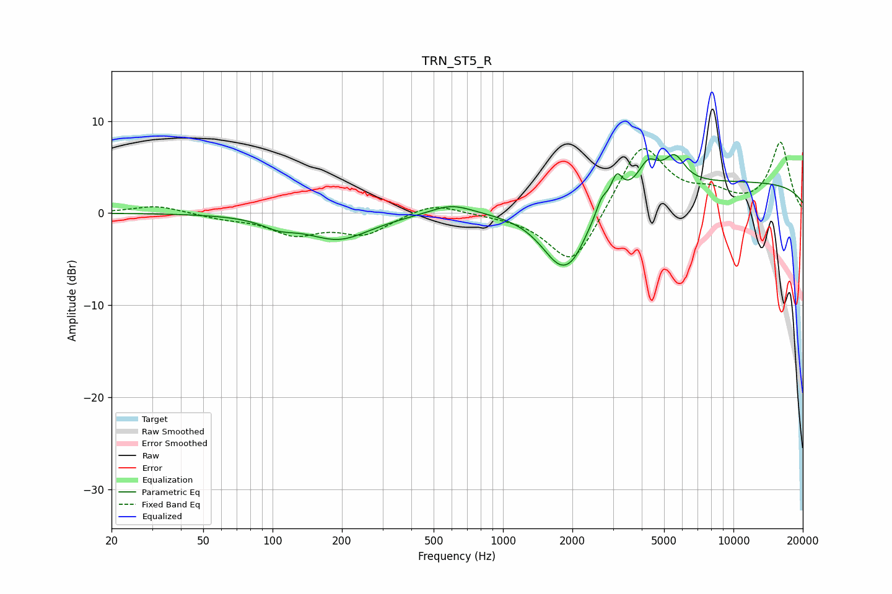

# TRN_ST5_R
See [usage instructions](https://github.com/jaakkopasanen/AutoEq#usage) for more options and info.

### Parametric EQs
Apply preamp of -6.5 dB when using parametric equalizer.

|   # | Type    |   Fc (Hz) |    Q |   Gain (dB) |
|-----|---------|-----------|------|-------------|
|   1 | Peaking |       106 | 1.94 |        -0.9 |
|   2 | Peaking |       193 | 1.01 |        -2.8 |
|   3 | Peaking |       597 | 1.53 |         1.2 |
|   4 | Peaking |      1802 | 1.51 |        -6.6 |
|   5 | Peaking |      2060 | 2.94 |        -1.1 |
|   6 | Peaking |      2676 | 5.95 |         1.4 |
|   7 | Peaking |      3112 | 5.64 |         2.7 |
|   8 | Peaking |      4263 | 3.2  |         2.8 |
|   9 | Peaking |      5549 | 3.08 |         2.9 |
|  10 | Peaking |     10000 | 0.18 |         3.3 |

### Fixed Band EQs
When using fixed band (also called graphic) equalizer, apply preamp of **-7.8 dB** (if available) and set gains manually with these parameters.

|   # | Type    |   Fc (Hz) |    Q |   Gain (dB) |
|-----|---------|-----------|------|-------------|
|   1 | Peaking |        31 | 1.41 |         0.9 |
|   2 | Peaking |        62 | 1.41 |        -0.5 |
|   3 | Peaking |       125 | 1.41 |        -2.1 |
|   4 | Peaking |       250 | 1.41 |        -2.2 |
|   5 | Peaking |       500 | 1.41 |         1.2 |
|   6 | Peaking |      1000 | 1.41 |        -0.1 |
|   7 | Peaking |      2000 | 1.41 |        -6.2 |
|   8 | Peaking |      4000 | 1.41 |         7.7 |
|   9 | Peaking |      8000 | 1.41 |         1.7 |
|  10 | Peaking |     16000 | 1.41 |         7.6 |

### Graphs

