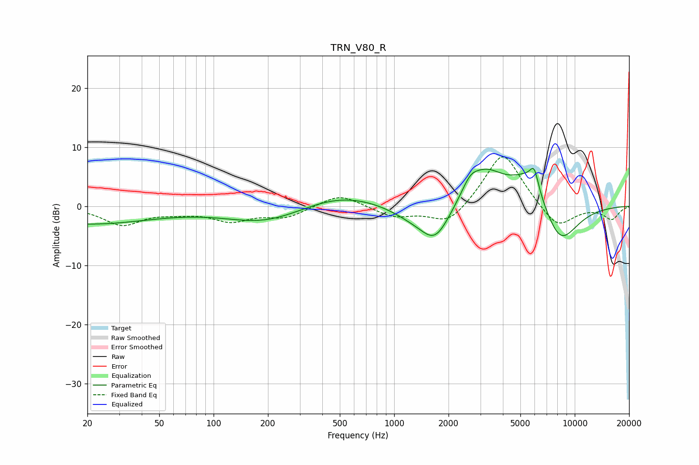

# TRN_V80_R
See [usage instructions](https://github.com/jaakkopasanen/AutoEq#usage) for more options and info.

### Parametric EQs
Apply preamp of -6.5 dB when using parametric equalizer.

|   # | Type    |   Fc (Hz) |    Q |   Gain (dB) |
|-----|---------|-----------|------|-------------|
|   1 | Peaking |        20 | 0.39 |        -3   |
|   2 | Peaking |       195 | 0.65 |        -2.8 |
|   3 | Peaking |       500 | 0.63 |         2.3 |
|   4 | Peaking |      1251 | 1.15 |        -1.6 |
|   5 | Peaking |      1689 | 1.66 |        -5.9 |
|   6 | Peaking |      2632 | 3.08 |         2.1 |
|   7 | Peaking |      3192 | 1.26 |         5.7 |
|   8 | Peaking |      5579 | 1.4  |         5.6 |
|   9 | Peaking |      5964 | 5.9  |         3.2 |
|  10 | Peaking |      8252 | 1.3  |        -7.4 |

### Fixed Band EQs
When using fixed band (also called graphic) equalizer, apply preamp of **-8.4 dB** (if available) and set gains manually with these parameters.

|   # | Type    |   Fc (Hz) |    Q |   Gain (dB) |
|-----|---------|-----------|------|-------------|
|   1 | Peaking |        31 | 1.41 |        -3.1 |
|   2 | Peaking |        62 | 1.41 |        -0.8 |
|   3 | Peaking |       125 | 1.41 |        -2.3 |
|   4 | Peaking |       250 | 1.41 |        -1.8 |
|   5 | Peaking |       500 | 1.41 |         2.2 |
|   6 | Peaking |      1000 | 1.41 |        -1.8 |
|   7 | Peaking |      2000 | 1.41 |        -3.4 |
|   8 | Peaking |      4000 | 1.41 |         9.6 |
|   9 | Peaking |      8000 | 1.41 |        -4.1 |
|  10 | Peaking |     16000 | 1.41 |        -2.2 |

### Graphs

