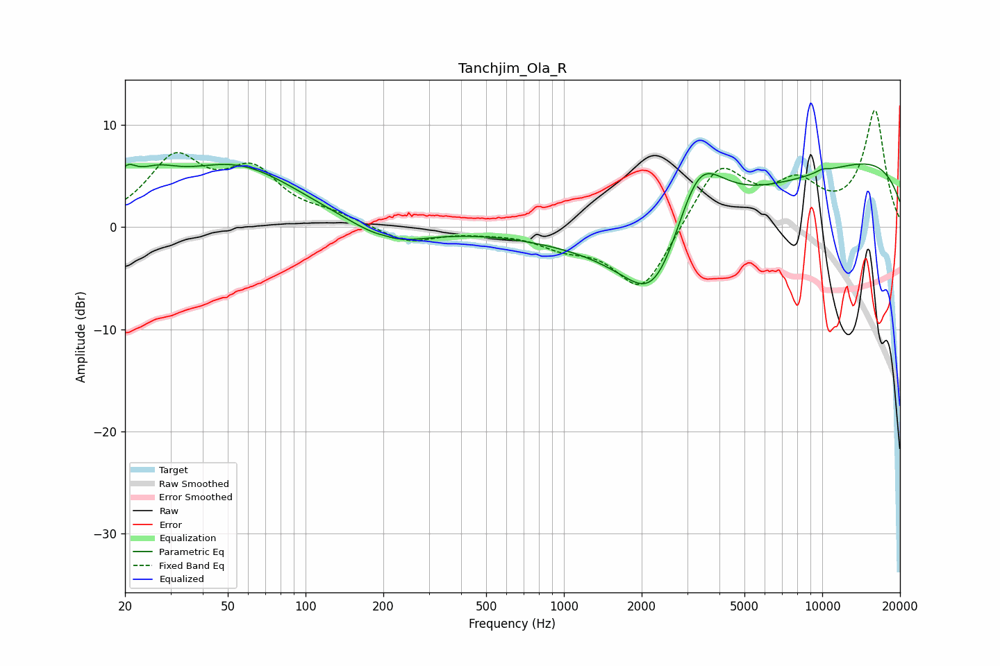

# Tanchjim_Ola_R
See [usage instructions](https://github.com/jaakkopasanen/AutoEq#usage) for more options and info.

### Parametric EQs
Apply preamp of -6.3 dB when using parametric equalizer.

|   # | Type    |   Fc (Hz) |    Q |   Gain (dB) |
|-----|---------|-----------|------|-------------|
|   1 | Peaking |        20 | 3.7  |         2.5 |
|   2 | Peaking |        26 | 1.61 |         2.3 |
|   3 | Peaking |        54 | 0.57 |         5.9 |
|   4 | Peaking |       203 | 5.65 |         0.1 |
|   5 | Peaking |       211 | 0.96 |        -2   |
|   6 | Peaking |      2257 | 1.14 |        -8.1 |
|   7 | Peaking |      3308 | 1.36 |         8.2 |
|   8 | Peaking |      4876 | 0.24 |        -5.8 |
|   9 | Peaking |     10000 | 0.22 |         9.9 |
|  10 | Peaking |     10000 | 5.25 |         0.3 |

### Fixed Band EQs
When using fixed band (also called graphic) equalizer, apply preamp of **-11.5 dB** (if available) and set gains manually with these parameters.

|   # | Type    |   Fc (Hz) |    Q |   Gain (dB) |
|-----|---------|-----------|------|-------------|
|   1 | Peaking |        31 | 1.41 |         6.3 |
|   2 | Peaking |        62 | 1.41 |         4.9 |
|   3 | Peaking |       125 | 1.41 |         0.9 |
|   4 | Peaking |       250 | 1.41 |        -1.6 |
|   5 | Peaking |       500 | 1.41 |        -0.3 |
|   6 | Peaking |      1000 | 1.41 |        -1.5 |
|   7 | Peaking |      2000 | 1.41 |        -6.5 |
|   8 | Peaking |      4000 | 1.41 |         6.2 |
|   9 | Peaking |      8000 | 1.41 |         3.7 |
|  10 | Peaking |     16000 | 1.41 |        11.2 |

### Graphs

