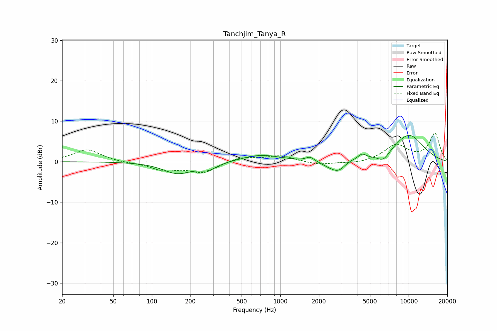

# Tanchjim_Tanya_R
See [usage instructions](https://github.com/jaakkopasanen/AutoEq#usage) for more options and info.

### Parametric EQs
Apply preamp of -6.6 dB when using parametric equalizer.

|   # | Type    |   Fc (Hz) |    Q |   Gain (dB) |
|-----|---------|-----------|------|-------------|
|   1 | Peaking |       158 | 1.29 |        -2.8 |
|   2 | Peaking |       273 | 2.02 |        -1.7 |
|   3 | Peaking |       708 | 0.94 |         1.7 |
|   4 | Peaking |      1707 | 4.48 |         1.1 |
|   5 | Peaking |      2360 | 2.54 |        -0.7 |
|   6 | Peaking |      2827 | 2.5  |        -2.4 |
|   7 | Peaking |      3466 | 3.79 |         0.3 |
|   8 | Peaking |      4327 | 4.31 |         1.3 |
|   9 | Peaking |      6355 | 2.8  |        -2.2 |
|  10 | Peaking |     10000 | 0.94 |         6.7 |

### Fixed Band EQs
When using fixed band (also called graphic) equalizer, apply preamp of **-7.1 dB** (if available) and set gains manually with these parameters.

|   # | Type    |   Fc (Hz) |    Q |   Gain (dB) |
|-----|---------|-----------|------|-------------|
|   1 | Peaking |        31 | 1.41 |         3   |
|   2 | Peaking |        62 | 1.41 |        -0.2 |
|   3 | Peaking |       125 | 1.41 |        -2   |
|   4 | Peaking |       250 | 1.41 |        -2.6 |
|   5 | Peaking |       500 | 1.41 |         1.2 |
|   6 | Peaking |      1000 | 1.41 |         1.5 |
|   7 | Peaking |      2000 | 1.41 |        -0.8 |
|   8 | Peaking |      4000 | 1.41 |        -0.5 |
|   9 | Peaking |      8000 | 1.41 |         4   |
|  10 | Peaking |     16000 | 1.41 |         6.8 |

### Graphs

