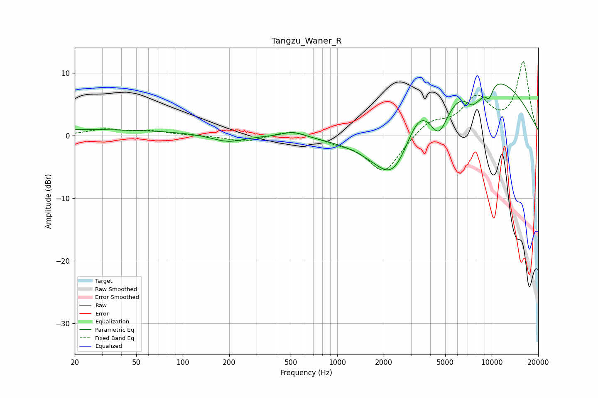

# Tangzu_Waner_R
See [usage instructions](https://github.com/jaakkopasanen/AutoEq#usage) for more options and info.

### Parametric EQs
Apply preamp of -8.3 dB when using parametric equalizer.

|   # | Type    |   Fc (Hz) |    Q |   Gain (dB) |
|-----|---------|-----------|------|-------------|
|   1 | Peaking |        21 | 0.18 |         1   |
|   2 | Peaking |       196 | 1.38 |        -1.2 |
|   3 | Peaking |       522 | 1.89 |         0.9 |
|   4 | Peaking |      2340 | 0.93 |       -10.7 |
|   5 | Peaking |      3350 | 1.42 |         4.9 |
|   6 | Peaking |      4556 | 2.23 |        -5.6 |
|   7 | Peaking |      7762 | 2.47 |        -5   |
|   8 | Peaking |      7864 | 5    |         1   |
|   9 | Peaking |      8383 | 0.35 |        10.7 |
|  10 | Peaking |      9621 | 5    |        -2.3 |

### Fixed Band EQs
When using fixed band (also called graphic) equalizer, apply preamp of **-11.9 dB** (if available) and set gains manually with these parameters.

|   # | Type    |   Fc (Hz) |    Q |   Gain (dB) |
|-----|---------|-----------|------|-------------|
|   1 | Peaking |        31 | 1.41 |         1   |
|   2 | Peaking |        62 | 1.41 |         0.6 |
|   3 | Peaking |       125 | 1.41 |         0   |
|   4 | Peaking |       250 | 1.41 |        -1   |
|   5 | Peaking |       500 | 1.41 |         1   |
|   6 | Peaking |      1000 | 1.41 |        -0.7 |
|   7 | Peaking |      2000 | 1.41 |        -6   |
|   8 | Peaking |      4000 | 1.41 |         2.3 |
|   9 | Peaking |      8000 | 1.41 |         5.6 |
|  10 | Peaking |     16000 | 1.41 |        11.6 |

### Graphs

