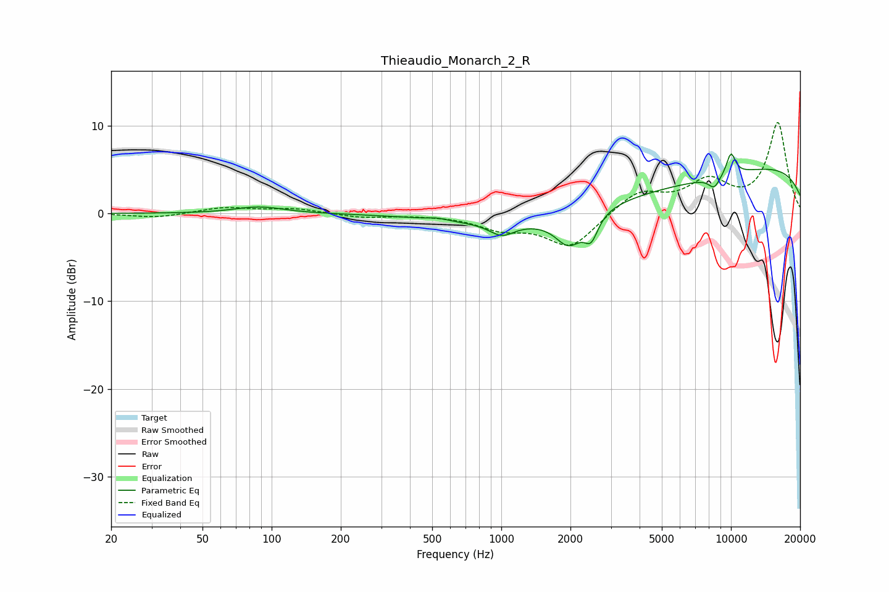

# Thieaudio_Monarch_2_R
See [usage instructions](https://github.com/jaakkopasanen/AutoEq#usage) for more options and info.

### Parametric EQs
Apply preamp of -6.9 dB when using parametric equalizer.

|   # | Type    |   Fc (Hz) |    Q |   Gain (dB) |
|-----|---------|-----------|------|-------------|
|   1 | Peaking |        79 | 1.57 |         0.2 |
|   2 | Peaking |        91 | 1.38 |         0.6 |
|   3 | Peaking |       525 | 3.79 |         0.2 |
|   4 | Peaking |      1006 | 2.62 |        -1.4 |
|   5 | Peaking |      1970 | 2.4  |        -3.4 |
|   6 | Peaking |      2462 | 4.73 |        -2.6 |
|   7 | Peaking |      3158 | 0.23 |        -2.7 |
|   8 | Peaking |      8459 | 5.06 |        -1.3 |
|   9 | Peaking |     10000 | 0.18 |         6.2 |
|  10 | Peaking |     10000 | 6    |         2.5 |

### Fixed Band EQs
When using fixed band (also called graphic) equalizer, apply preamp of **-10.4 dB** (if available) and set gains manually with these parameters.

|   # | Type    |   Fc (Hz) |    Q |   Gain (dB) |
|-----|---------|-----------|------|-------------|
|   1 | Peaking |        31 | 1.41 |        -0.5 |
|   2 | Peaking |        62 | 1.41 |         0.7 |
|   3 | Peaking |       125 | 1.41 |         0.5 |
|   4 | Peaking |       250 | 1.41 |        -0.5 |
|   5 | Peaking |       500 | 1.41 |        -0.1 |
|   6 | Peaking |      1000 | 1.41 |        -1.5 |
|   7 | Peaking |      2000 | 1.41 |        -3.8 |
|   8 | Peaking |      4000 | 1.41 |         2.5 |
|   9 | Peaking |      8000 | 1.41 |         3.4 |
|  10 | Peaking |     16000 | 1.41 |        10.2 |

### Graphs

