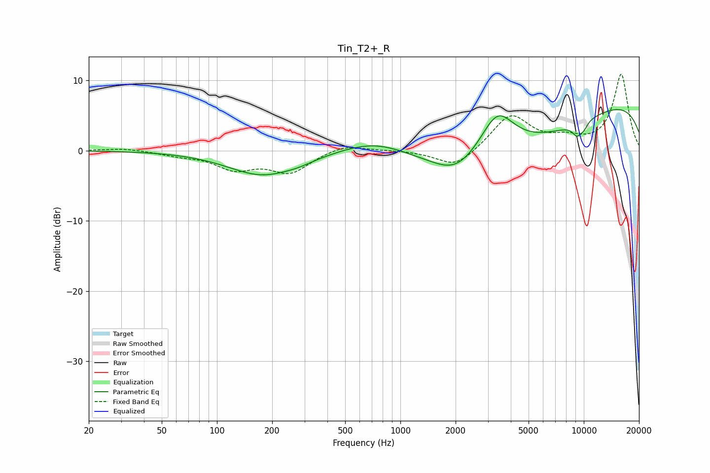

# Tin_T2+_R
See [usage instructions](https://github.com/jaakkopasanen/AutoEq#usage) for more options and info.

### Parametric EQs
Apply preamp of -5.9 dB when using parametric equalizer.

|   # | Type    |   Fc (Hz) |    Q |   Gain (dB) |
|-----|---------|-----------|------|-------------|
|   1 | Peaking |       176 | 0.75 |        -3.4 |
|   2 | Peaking |       279 | 1.76 |        -0.4 |
|   3 | Peaking |       502 | 2.81 |         0   |
|   4 | Peaking |       730 | 0.83 |         1.9 |
|   5 | Peaking |      2003 | 1.19 |        -2.6 |
|   6 | Peaking |      3378 | 1.52 |         6.1 |
|   7 | Peaking |      4198 | 0.31 |        -6.6 |
|   8 | Peaking |      9190 | 4.89 |        -1.6 |
|   9 | Peaking |      9817 | 0.19 |         8.3 |
|  10 | Peaking |     10000 | 5.61 |        -0.9 |

### Fixed Band EQs
When using fixed band (also called graphic) equalizer, apply preamp of **-10.9 dB** (if available) and set gains manually with these parameters.

|   # | Type    |   Fc (Hz) |    Q |   Gain (dB) |
|-----|---------|-----------|------|-------------|
|   1 | Peaking |        31 | 1.41 |         0.4 |
|   2 | Peaking |        62 | 1.41 |        -0.6 |
|   3 | Peaking |       125 | 1.41 |        -2.4 |
|   4 | Peaking |       250 | 1.41 |        -3   |
|   5 | Peaking |       500 | 1.41 |         1   |
|   6 | Peaking |      1000 | 1.41 |         0.1 |
|   7 | Peaking |      2000 | 1.41 |        -2.6 |
|   8 | Peaking |      4000 | 1.41 |         5.1 |
|   9 | Peaking |      8000 | 1.41 |         1.3 |
|  10 | Peaking |     16000 | 1.41 |        10.8 |

### Graphs

