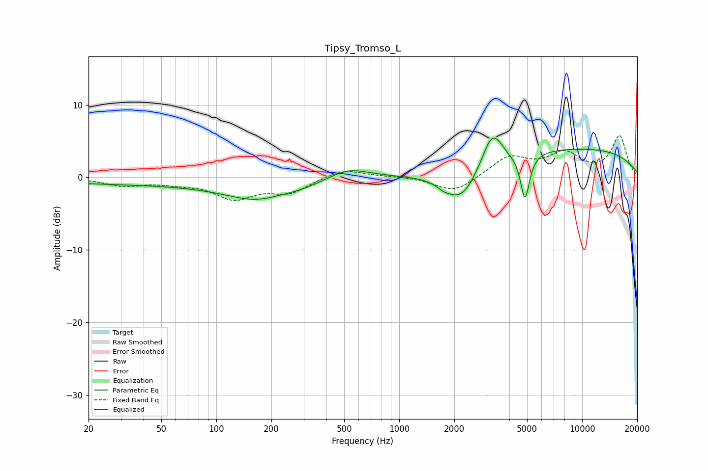

# Tipsy_Tromso_L
See [usage instructions](https://github.com/jaakkopasanen/AutoEq#usage) for more options and info.

### Parametric EQs
Apply preamp of -5.5 dB when using parametric equalizer.

|   # | Type    |   Fc (Hz) |    Q |   Gain (dB) |
|-----|---------|-----------|------|-------------|
|   1 | Peaking |        47 | 0.19 |        -0.9 |
|   2 | Peaking |       194 | 0.74 |        -3.3 |
|   3 | Peaking |       216 | 1.33 |         1   |
|   4 | Peaking |       522 | 1.23 |         1.7 |
|   5 | Peaking |      1741 | 5.33 |        -0.3 |
|   6 | Peaking |      2163 | 1.48 |        -4.8 |
|   7 | Peaking |      3194 | 2.67 |         4.6 |
|   8 | Peaking |      3517 | 5.02 |         0.4 |
|   9 | Peaking |      4870 | 5.74 |        -6.4 |
|  10 | Peaking |      9024 | 0.24 |         4   |

### Fixed Band EQs
When using fixed band (also called graphic) equalizer, apply preamp of **-5.9 dB** (if available) and set gains manually with these parameters.

|   # | Type    |   Fc (Hz) |    Q |   Gain (dB) |
|-----|---------|-----------|------|-------------|
|   1 | Peaking |        31 | 1.41 |        -1.1 |
|   2 | Peaking |        62 | 1.41 |        -0.6 |
|   3 | Peaking |       125 | 1.41 |        -2.7 |
|   4 | Peaking |       250 | 1.41 |        -2   |
|   5 | Peaking |       500 | 1.41 |         1.2 |
|   6 | Peaking |      1000 | 1.41 |         0.1 |
|   7 | Peaking |      2000 | 1.41 |        -2.2 |
|   8 | Peaking |      4000 | 1.41 |         2.8 |
|   9 | Peaking |      8000 | 1.41 |         3.1 |
|  10 | Peaking |     16000 | 1.41 |         5.6 |

### Graphs

