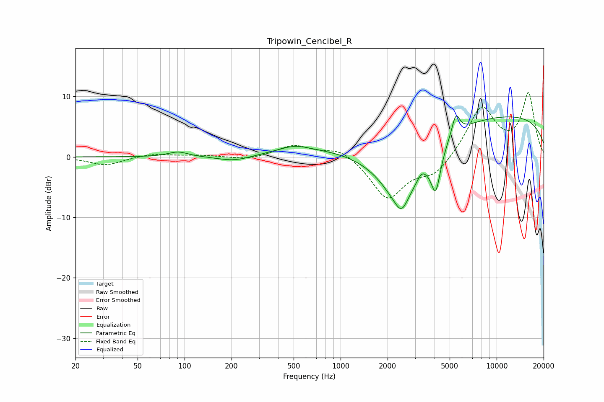

# Tripowin_Cencibel_R
See [usage instructions](https://github.com/jaakkopasanen/AutoEq#usage) for more options and info.

### Parametric EQs
Apply preamp of -6.9 dB when using parametric equalizer.

|   # | Type    |   Fc (Hz) |    Q |   Gain (dB) |
|-----|---------|-----------|------|-------------|
|   1 | Peaking |        91 | 2.24 |         0.8 |
|   2 | Peaking |       209 | 1.29 |        -0.9 |
|   3 | Peaking |       505 | 1.54 |         0.9 |
|   4 | Peaking |       714 | 0.47 |         1.2 |
|   5 | Peaking |      2443 | 1.04 |       -11.1 |
|   6 | Peaking |      2452 | 4.2  |        -1.7 |
|   7 | Peaking |      3300 | 5.42 |         0.9 |
|   8 | Peaking |      4072 | 4.4  |        -6.9 |
|   9 | Peaking |      5479 | 5.37 |         3.5 |
|  10 | Peaking |      9815 | 0.18 |         7   |

### Fixed Band EQs
When using fixed band (also called graphic) equalizer, apply preamp of **-10.7 dB** (if available) and set gains manually with these parameters.

|   # | Type    |   Fc (Hz) |    Q |   Gain (dB) |
|-----|---------|-----------|------|-------------|
|   1 | Peaking |        31 | 1.41 |        -1.4 |
|   2 | Peaking |        62 | 1.41 |         0.5 |
|   3 | Peaking |       125 | 1.41 |         0.3 |
|   4 | Peaking |       250 | 1.41 |        -0.5 |
|   5 | Peaking |       500 | 1.41 |         1.9 |
|   6 | Peaking |      1000 | 1.41 |         1.7 |
|   7 | Peaking |      2000 | 1.41 |        -6.9 |
|   8 | Peaking |      4000 | 1.41 |        -2.9 |
|   9 | Peaking |      8000 | 1.41 |         8.2 |
|  10 | Peaking |     16000 | 1.41 |        10.3 |

### Graphs

