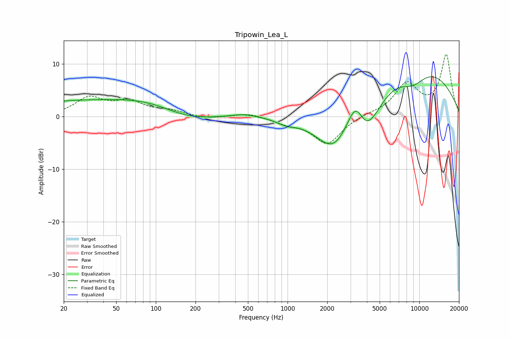

# Tripowin_Lea_L
See [usage instructions](https://github.com/jaakkopasanen/AutoEq#usage) for more options and info.

### Parametric EQs
Apply preamp of -7.6 dB when using parametric equalizer.

|   # | Type    |   Fc (Hz) |    Q |   Gain (dB) |
|-----|---------|-----------|------|-------------|
|   1 | Peaking |        32 | 0.23 |         3   |
|   2 | Peaking |        84 | 0.74 |         0.8 |
|   3 | Peaking |       177 | 0.73 |        -1.3 |
|   4 | Peaking |       467 | 1.47 |         0.6 |
|   5 | Peaking |       978 | 1.98 |        -0.9 |
|   6 | Peaking |      2236 | 0.98 |        -8   |
|   7 | Peaking |      3313 | 1.81 |         8.9 |
|   8 | Peaking |      3849 | 1.09 |       -11.7 |
|   9 | Peaking |      8245 | 0.37 |        14.5 |
|  10 | Peaking |      8791 | 0.99 |        -6.5 |

### Fixed Band EQs
When using fixed band (also called graphic) equalizer, apply preamp of **-11.9 dB** (if available) and set gains manually with these parameters.

|   # | Type    |   Fc (Hz) |    Q |   Gain (dB) |
|-----|---------|-----------|------|-------------|
|   1 | Peaking |        31 | 1.41 |         3.3 |
|   2 | Peaking |        62 | 1.41 |         2.5 |
|   3 | Peaking |       125 | 1.41 |         0.9 |
|   4 | Peaking |       250 | 1.41 |        -0.5 |
|   5 | Peaking |       500 | 1.41 |         0.7 |
|   6 | Peaking |      1000 | 1.41 |        -1.1 |
|   7 | Peaking |      2000 | 1.41 |        -5.2 |
|   8 | Peaking |      4000 | 1.41 |         0.4 |
|   9 | Peaking |      8000 | 1.41 |         6   |
|  10 | Peaking |     16000 | 1.41 |        11.6 |

### Graphs

