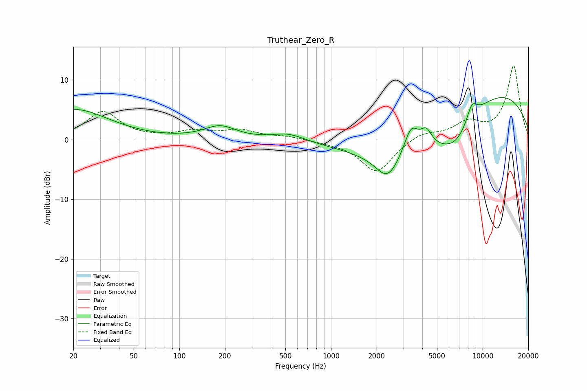

# Truthear_Zero_R
See [usage instructions](https://github.com/jaakkopasanen/AutoEq#usage) for more options and info.

### Parametric EQs
Apply preamp of -7.2 dB when using parametric equalizer.

|   # | Type    |   Fc (Hz) |    Q |   Gain (dB) |
|-----|---------|-----------|------|-------------|
|   1 | Peaking |        20 | 0.61 |         5.1 |
|   2 | Peaking |       186 | 1.34 |         2.1 |
|   3 | Peaking |       525 | 1.36 |         1.2 |
|   4 | Peaking |      2358 | 1.86 |        -4   |
|   5 | Peaking |      3377 | 2.8  |         4.9 |
|   6 | Peaking |      3705 | 0.42 |        -8.3 |
|   7 | Peaking |      4246 | 3.72 |         2.8 |
|   8 | Peaking |      6648 | 1.2  |        -4.2 |
|   9 | Peaking |      8497 | 3.7  |         2.9 |
|  10 | Peaking |      9276 | 0.25 |        10.2 |

### Fixed Band EQs
When using fixed band (also called graphic) equalizer, apply preamp of **-12.4 dB** (if available) and set gains manually with these parameters.

|   # | Type    |   Fc (Hz) |    Q |   Gain (dB) |
|-----|---------|-----------|------|-------------|
|   1 | Peaking |        31 | 1.41 |         4.6 |
|   2 | Peaking |        62 | 1.41 |         0.1 |
|   3 | Peaking |       125 | 1.41 |         1.3 |
|   4 | Peaking |       250 | 1.41 |         1.5 |
|   5 | Peaking |       500 | 1.41 |         0.5 |
|   6 | Peaking |      1000 | 1.41 |        -0.3 |
|   7 | Peaking |      2000 | 1.41 |        -5.5 |
|   8 | Peaking |      4000 | 1.41 |         1.3 |
|   9 | Peaking |      8000 | 1.41 |         2.6 |
|  10 | Peaking |     16000 | 1.41 |        12.3 |

### Graphs

