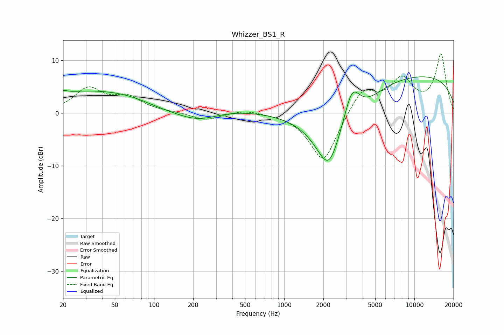

# Whizzer_BS1_R
See [usage instructions](https://github.com/jaakkopasanen/AutoEq#usage) for more options and info.

### Parametric EQs
Apply preamp of -7.0 dB when using parametric equalizer.

|   # | Type    |   Fc (Hz) |    Q |   Gain (dB) |
|-----|---------|-----------|------|-------------|
|   1 | Peaking |        20 | 4.98 |         0.5 |
|   2 | Peaking |        57 | 0.18 |         4.8 |
|   3 | Peaking |       112 | 0.76 |        -1.9 |
|   4 | Peaking |       200 | 0.82 |        -3   |
|   5 | Peaking |       269 | 1.12 |        -0.5 |
|   6 | Peaking |      2202 | 1.19 |       -13.2 |
|   7 | Peaking |      3318 | 2.2  |         6.8 |
|   8 | Peaking |      3971 | 1.03 |        -2.4 |
|   9 | Peaking |      8381 | 0.24 |         2.1 |
|  10 | Peaking |     10000 | 0.19 |         5.3 |

### Fixed Band EQs
When using fixed band (also called graphic) equalizer, apply preamp of **-11.3 dB** (if available) and set gains manually with these parameters.

|   # | Type    |   Fc (Hz) |    Q |   Gain (dB) |
|-----|---------|-----------|------|-------------|
|   1 | Peaking |        31 | 1.41 |         4.4 |
|   2 | Peaking |        62 | 1.41 |         2.7 |
|   3 | Peaking |       125 | 1.41 |         0.2 |
|   4 | Peaking |       250 | 1.41 |        -1.4 |
|   5 | Peaking |       500 | 1.41 |         0.7 |
|   6 | Peaking |      1000 | 1.41 |         0.1 |
|   7 | Peaking |      2000 | 1.41 |        -9.6 |
|   8 | Peaking |      4000 | 1.41 |         4.8 |
|   9 | Peaking |      8000 | 1.41 |         5.9 |
|  10 | Peaking |     16000 | 1.41 |        10.9 |

### Graphs

