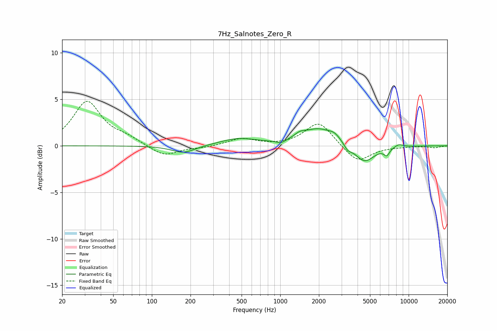

# 7Hz_Salnotes_Zero_R
See [usage instructions](https://github.com/jaakkopasanen/AutoEq#usage) for more options and info.

### Parametric EQs
Apply preamp of -1.9 dB when using parametric equalizer.

|   # | Type    |   Fc (Hz) |    Q |   Gain (dB) |
|-----|---------|-----------|------|-------------|
|   1 | Peaking |       176 | 1.57 |        -0.8 |
|   2 | Peaking |       473 | 1.02 |         0.8 |
|   3 | Peaking |      1014 | 3.83 |        -0.4 |
|   4 | Peaking |      1420 | 3.67 |         0.4 |
|   5 | Peaking |      1984 | 1.08 |         1.8 |
|   6 | Peaking |      2654 | 3.32 |         0.5 |
|   7 | Peaking |      3354 | 5.29 |        -0.5 |
|   8 | Peaking |      4519 | 1.75 |        -1.9 |
|   9 | Peaking |      6753 | 6    |        -0.7 |
|  10 | Peaking |      8379 | 4.06 |         0.3 |

### Fixed Band EQs
When using fixed band (also called graphic) equalizer, apply preamp of **-4.9 dB** (if available) and set gains manually with these parameters.

|   # | Type    |   Fc (Hz) |    Q |   Gain (dB) |
|-----|---------|-----------|------|-------------|
|   1 | Peaking |        31 | 1.41 |         4.7 |
|   2 | Peaking |        62 | 1.41 |         0.7 |
|   3 | Peaking |       125 | 1.41 |        -1.2 |
|   4 | Peaking |       250 | 1.41 |        -0.2 |
|   5 | Peaking |       500 | 1.41 |         0.8 |
|   6 | Peaking |      1000 | 1.41 |        -0   |
|   7 | Peaking |      2000 | 1.41 |         2.6 |
|   8 | Peaking |      4000 | 1.41 |        -1.9 |
|   9 | Peaking |      8000 | 1.41 |        -0.1 |
|  10 | Peaking |     16000 | 1.41 |        -0.2 |

### Graphs

