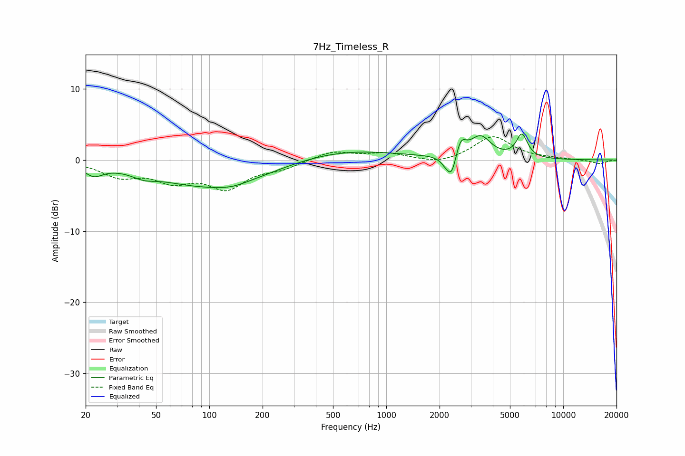

# 7Hz_Timeless_R
See [usage instructions](https://github.com/jaakkopasanen/AutoEq#usage) for more options and info.

### Parametric EQs
Apply preamp of -3.7 dB when using parametric equalizer.

|   # | Type    |   Fc (Hz) |    Q |   Gain (dB) |
|-----|---------|-----------|------|-------------|
|   1 | Peaking |        22 | 2.72 |        -1.5 |
|   2 | Peaking |        43 | 2.27 |        -0.7 |
|   3 | Peaking |       106 | 0.44 |        -3.8 |
|   4 | Peaking |       134 | 1.78 |        -0.4 |
|   5 | Peaking |       551 | 0.45 |         1.6 |
|   6 | Peaking |      2194 | 4.42 |        -1.2 |
|   7 | Peaking |      2352 | 5.74 |        -2.6 |
|   8 | Peaking |      2636 | 4.87 |         2.4 |
|   9 | Peaking |      3408 | 2.41 |         3   |
|  10 | Peaking |      5841 | 4.42 |         3.3 |

### Fixed Band EQs
When using fixed band (also called graphic) equalizer, apply preamp of **-3.4 dB** (if available) and set gains manually with these parameters.

|   # | Type    |   Fc (Hz) |    Q |   Gain (dB) |
|-----|---------|-----------|------|-------------|
|   1 | Peaking |        31 | 1.41 |        -2.1 |
|   2 | Peaking |        62 | 1.41 |        -2.5 |
|   3 | Peaking |       125 | 1.41 |        -3.6 |
|   4 | Peaking |       250 | 1.41 |        -1   |
|   5 | Peaking |       500 | 1.41 |         1.2 |
|   6 | Peaking |      1000 | 1.41 |         0.9 |
|   7 | Peaking |      2000 | 1.41 |        -0.7 |
|   8 | Peaking |      4000 | 1.41 |         3.3 |
|   9 | Peaking |      8000 | 1.41 |         0.1 |
|  10 | Peaking |     16000 | 1.41 |        -0.5 |

### Graphs

