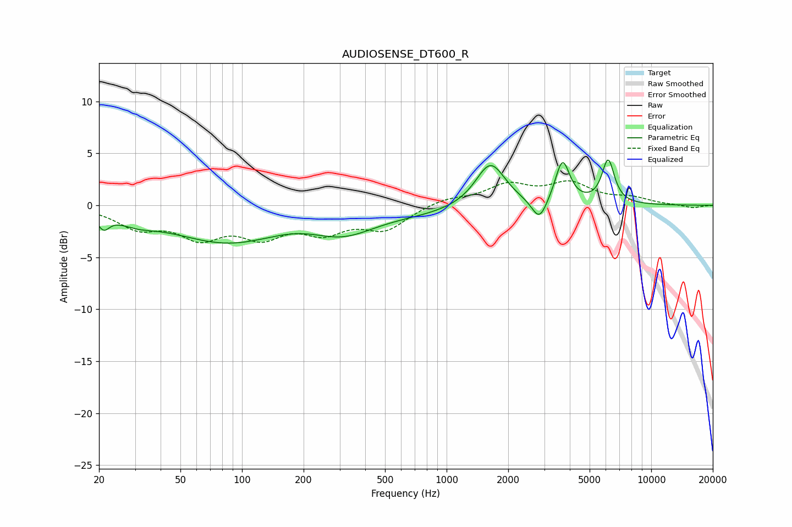

# AUDIOSENSE_DT600_R
See [usage instructions](https://github.com/jaakkopasanen/AutoEq#usage) for more options and info.

### Parametric EQs
Apply preamp of -4.5 dB when using parametric equalizer.

|   # | Type    |   Fc (Hz) |    Q |   Gain (dB) |
|-----|---------|-----------|------|-------------|
|   1 | Peaking |        21 | 5.12 |        -1.3 |
|   2 | Peaking |        31 | 1.54 |        -0.8 |
|   3 | Peaking |        87 | 0.5  |        -3.6 |
|   4 | Peaking |       192 | 0.76 |         0.7 |
|   5 | Peaking |       309 | 0.87 |        -2.3 |
|   6 | Peaking |       775 | 0.66 |        -0.6 |
|   7 | Peaking |      1637 | 1.96 |         4.2 |
|   8 | Peaking |      2842 | 3.78 |        -2.2 |
|   9 | Peaking |      3686 | 4.01 |         4.2 |
|  10 | Peaking |      6159 | 4.55 |         4.2 |

### Fixed Band EQs
When using fixed band (also called graphic) equalizer, apply preamp of **-2.5 dB** (if available) and set gains manually with these parameters.

|   # | Type    |   Fc (Hz) |    Q |   Gain (dB) |
|-----|---------|-----------|------|-------------|
|   1 | Peaking |        31 | 1.41 |        -1.9 |
|   2 | Peaking |        62 | 1.41 |        -2.7 |
|   3 | Peaking |       125 | 1.41 |        -2.5 |
|   4 | Peaking |       250 | 1.41 |        -2.2 |
|   5 | Peaking |       500 | 1.41 |        -2.2 |
|   6 | Peaking |      1000 | 1.41 |         0.7 |
|   7 | Peaking |      2000 | 1.41 |         1.8 |
|   8 | Peaking |      4000 | 1.41 |         2   |
|   9 | Peaking |      8000 | 1.41 |         0.6 |
|  10 | Peaking |     16000 | 1.41 |        -0.3 |

### Graphs

